# LLMs

## The History of Chatbots

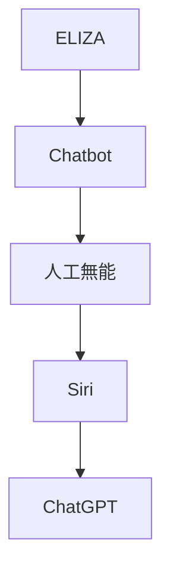

*[ELIZA](https://en.wikipedia.org/wiki/ELIZA) (1966)*
初期の人工知能プログラムのひとつ。
ルールベースの簡単なパターンマッチングで返答していた。
心理療法士の会話を模したELIZA(DOCTOR)が有名。

*[PARRY](https://ja.wikipedia.org/wiki/PARRY) (1972)*
PARRYは偏執病的統合失調症患者をシミュレートしようとしたもの。
ELIZA(DOCTOR)と通信し話題となった。

*[Jabberwacky](https://ja.wikipedia.org/wiki/Jabberwacky) (1982, 1988, 1997)*
ユーモラスな人間同士の自然な会話をシミュレートすることを目的としていた。
ユーザーとの会話の大規模なデータベースを構築し、言語と文脈を学習することができた。
プロジェクト自体は1982年から開始されていたが、当初は学習機能は有していなかった。
ローブナー賞を2005年(George)、2006年(Joan)に受賞している。
ローブナー賞(Loebner Prize)はチャットボットが人間と区別できないほどの会話能力を持つか評価するコンテストのこと。

*[A.L.I.C.E.](https://ja.wikipedia.org/wiki/Artificial_Linguistic_Internet_Computer_Entity) (1995)*
ヒューリスティックパターンマッチングを使用している。
AIML(Artificial Intelligence Markup Language)というXMLベースで条件を記述できた。
ローブナー賞を2000年、2001年、2004年に受賞している。

AIMLインタプリタなどがGPLライセンスで公開されたため、後の多くのチャットボットがGPLで作成されている。
また、様々なプログラミング言語へ移植され、SlackやDiscord向けも存在している。

*[人工無能](https://ja.wikipedia.org/wiki/%E4%BA%BA%E5%B7%A5%E7%84%A1%E8%84%B3) (1995)*
一方日本では、ゆいぼっとや人工無能うずらが流行っていた。
日本語は分かち書きされておらず、[形態素解析](https://ja.wikipedia.org/wiki/%E5%BD%A2%E6%85%8B%E7%B4%A0%E8%A7%A3%E6%9E%90)などの前処理が必要だった。

代表的な形態素解析ソフトウェアは以下の通り。
[JUMAN](https://ja.wikipedia.org/wiki/JUMAN) (1987)
[ChaSen 茶筌](https://ja.wikipedia.org/wiki/ChaSen) (1995)
[MeCab 和布蕪](https://ja.wikipedia.org/wiki/MeCab) (2005)
JUMAN++ (2015)

*[デスクトップ マスコット](https://ja.wikipedia.org/wiki/%E4%BC%BA%E3%81%8B) (1998)*
その後、ペルソナウェア、偽ペルソナウェア、伺か、が流行っていた。

*[SmarterChild](https://en.wikipedia.org/wiki/SmarterChild) (2001)*
AOL、MSN、Yahooなどのメッセンジャーで利用できた。
ニュース、天気、株式などの情報にアクセスできた。
ユーザー数は1000万を超え、1日に10億通のやり取りがあったとされる。

*[Siri](https://ja.wikipedia.org/wiki/Siri) (2010.02)*
Hey, Siri!
iPhoneに搭載され話題となった。

*[IBM Watson](https://en.wikipedia.org/wiki/IBM_Watson) (2011)*
クイズ番組に出場させるために開発された。

2013年には、Watsonにより人間味を持たせようと俗語辞書Urban Dictionaryを学習させたことにより、下品な言葉遣いになった事例がある。
この試みは中断され、スマートフィルターが開発されることとなった。

*[Google Now](https://ja.wikipedia.org/wiki/Google_Now) (2012)*
OK, Google!
Androidに搭載され話題となった。

*[Mitsuku](https://en.wikipedia.org/wiki/Kuki_AI) (2013)*
A.L.I.C.E.で開発されたAIMLをすべて含んでいる。
2013年から2019年の間にローブナー賞を5回受賞している。
これ以降はローブナー賞は中止された。

2021年にはKuki AIという名前に変わり、メタバースに進出した。

*[Alexa](https://ja.wikipedia.org/wiki/Amazon_Alexa) (2014)*
Amazon Echoに搭載され話題となった。
スキルと呼ばれるサードパーティ製のアプリを活用することができる。

同時期にWindowsのCortanaなどがある。

*[りんな](https://ja.wikipedia.org/wiki/%E3%82%8A%E3%82%93%E3%81%AA_(%E4%BA%BA%E5%B7%A5%E7%9F%A5%E8%83%BD)) (2015)*
女子高生AIとしてLINEに登場して話題となった。

同時期にMicrosoft TayがTwitterに登場しているが、ユーザーとの会話を学習する機能により調教されたため、問題発言を繰り返し終了された。

*[Googleアシスタント](https://ja.wikipedia.org/wiki/Google_%E3%82%A2%E3%82%B7%E3%82%B9%E3%82%BF%E3%83%B3%E3%83%88) (2016.05.18)*
双方向の会話が可能となった。
今までのGoogle Nowの仕組みと組み合わせて、音声でAndroidを操作することができる。

*[Meena](https://ja.wikipedia.org/wiki/LaMDA) (2020)*
人間に近いオープンドメインのチャットボットとして公開された。
感性を持って応答するように訓練されている。

MeenaをもとにしたLaMDAは、Googleのエンジニアが「AIが感情や意識を持った」とリークし話題となった。

*[ChatGPT](https://ja.wikipedia.org/wiki/ChatGPT) (2022)*
OpenAIが開発した大規模言語モデルGPT-3.5を利用したシステム。
大規模言語モデルの特徴として、対話だけでなく、要約や翻訳などさまざまな自然言語処理を行うことができる。
プログラミング用のCodexなどを組み込まれている。
チャット形式で簡単に使えるようにしたので爆発的な人気を呼んだ。

GPT-4を搭載するようになりマルチモーダル化している。

*[Bard](https://ja.wikipedia.org/wiki/Bard) (2023)*
Googleが開発した大規模言語モデルを利用したシステム。
Googleのさまざまなサービスにアクセスできる強味がある。

LaMDA、PaLM、PaLM2、Geminiとアップデートされた。
Geminiでマルチモーダル化した。

## The History of LLMs

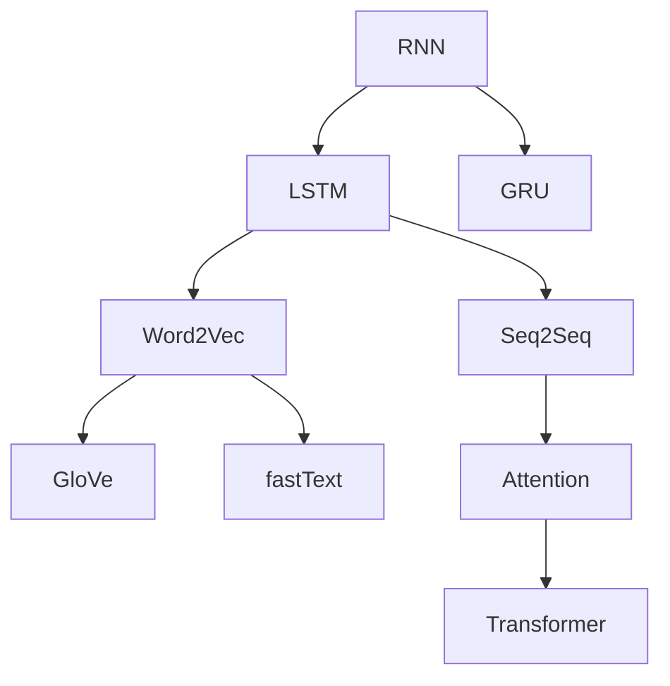

*[RNN](https://ja.wikipedia.org/wiki/%E5%9B%9E%E5%B8%B0%E5%9E%8B%E3%83%8B%E3%83%A5%E3%83%BC%E3%83%A9%E3%83%AB%E3%83%8D%E3%83%83%E3%83%88%E3%83%AF%E3%83%BC%E3%82%AF) (1986, 2012)*
RNNの考え自体は昔からあった。
中間層で再帰的な結合があり、時系列のデータを処理することができた。
しかし、再帰的な処理は計算コストが高く、ハードウェアの性能が足りなかった。
また勾配消失があり学習が収束しない問題があった。
そのため、RNN以外の研究に移っていった。

CNNの画像認識でDeep Learningが注目を集め、RNNに注目が戻ってきた。

*[LSTM](https://ja.wikipedia.org/wiki/%E9%95%B7%E3%83%BB%E7%9F%AD%E6%9C%9F%E8%A8%98%E6%86%B6) (1997, 2012)*
RNNの勾配消失を解決するためにLSTMが登場した。
長期的な記憶を保持することができるようになった。
しかし、実際には、非常に長い依存関係を適切にとらえることは難しかった。

Deap Learningが注目を集め、LSTMもその一部として広く使われるようになった。

*[GRU](https://ja.wikipedia.org/wiki/%E3%82%B2%E3%83%BC%E3%83%88%E4%BB%98%E3%81%8D%E5%9B%9E%E5%B8%B0%E5%9E%8B%E3%83%A6%E3%83%8B%E3%83%83%E3%83%88) (2014)*
LSTMよりも簡単な構造を持ち、パラメータ数が少なく、計算コストが低い。
いくつかの問題ではLSTMに類似する性能が発揮された。
しかし、LSTMの優位性を上回ることができなかった。

*[Word2Vec](https://ja.wikipedia.org/wiki/Word2vec) (2013 Google)*
[Efficient Estimation of Word Representations in Vector Space](https://arxiv.org/abs/1301.3781)
Word2Vecというワードをベクトル化して計算できる手法が登場した。

*[GloVe](https://en.wikipedia.org/wiki/GloVe) (2014.01.02 Stanford)*
[Global Vectors for Word Representation](https://aclanthology.org/D14-1162/)
Word2Vecの局所的(local)な表現と、大局的(Global)な表現を組み合わせた手法。

*[fastText](https://en.wikipedia.org/wiki/FastText) (2015 Facebook)*
[facebookresearch/fastText](https://github.com/facebookresearch/fastText)
Self-Attentionの原型。

*[Seq2Seq](https://en.wikipedia.org/wiki/Seq2seq) (2014 Google)*
[Sequence to Sequence Learning with Neural Networks](https://arxiv.org/abs/1409.3215)
EncoderとDecoderを搭載したSeq2Seqという手法が登場した。
Seq2Seqは、翻訳や対話システム、要約などの様々な自然言語処理のタスクで、高い精度を達成することができた。

*[Attention](https://ja.wikipedia.org/wiki/%E3%82%A2%E3%83%86%E3%83%B3%E3%82%B7%E3%83%A7%E3%83%B3_(%E6%A9%9F%E6%A2%B0%E5%AD%A6%E7%BF%92)) (2015.09)*
[Effective Approaches to Attention-based Neural Machine Translation](https://arxiv.org/abs/1508.04025)
ニューラル機械翻訳において、従来のSeq2SeqにAttentionメカニズムを導入することで、翻訳の品質を向上させることができた。

*[Transformer](https://ja.wikipedia.org/wiki/Transformer_(%E6%A9%9F%E6%A2%B0%E5%AD%A6%E7%BF%92%E3%83%A2%E3%83%87%E3%83%AB)) (2017.06.12 Google)*
[Attention Is All You Need](https://arxiv.org/abs/1706.03762)
RNNやLSTMは再帰的に処理を行うため、長い文脈だと計算コストが増大する問題があった。
Scaled Dot-Product Attentionを用いることで、長期依存関係を効率的に処理できるようになった。
またAttentionを複数のヘッドで並列にするMulti-Head Attentionの形態を取る。
RNNとは違い、全ての位置の計算を同時に行うことが可能となり、GPUを効率的に使用できるようになった。

Scaled Dot-Product AttentionはSelf-Attentionの一種で、必要なメモリが文章の長さの二乗に比例する。
LSTMに比べて計算速度は速いが、入力が長くなると計算負荷が高い。

その後、パラメータ数が増加していくと必要なメモリが足りなくなり、さまざまな派生アルゴリズムが考えられた。

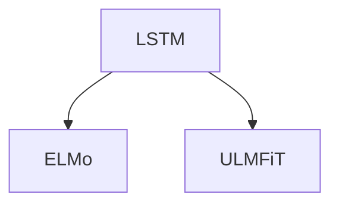

*[ELMo](https://en.wikipedia.org/wiki/ELMo) (2018.02.15 AllenAI)*
パラメータ数: 300M
[Deep contextualized word representations](https://arxiv.org/abs/1802.05365)
Word2VecやGloVeでは単語のみのベクトル化だったので、文脈を考慮できるようにしたもの。
2層のLSTMを2つ使った、双方向LSTM。

*ULMFiT (2018.02.18 fast.ai)*
[Universal Language Model Fine-tuning for Text Classification](https://arxiv.org/abs/1801.06146)
事前学習(Pre-train)と微調整(Fine-tuning)という今のLLMの原型となるもの。

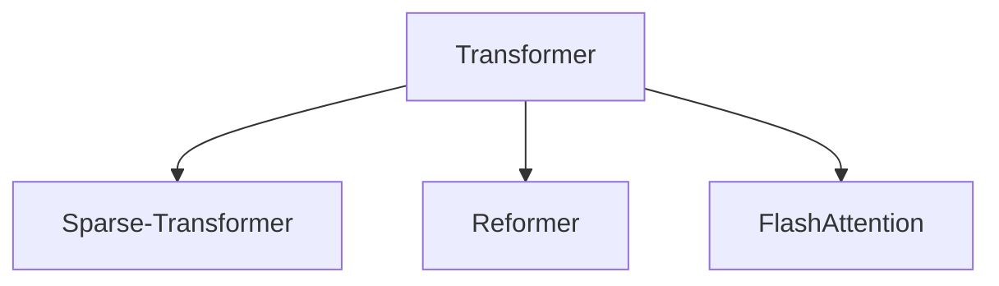

*Sparse Transformer (2019.04.23 OpenAI)*
[Generating Long Sequences with Sparse Transformers](https://arxiv.org/abs/1904.10509)
通常のTransformerでは、トークンが他の全てのトークンと相互作用する全結合となっているが、
Sparse Transformerでは、一部のトークンのみと相互作用する手法を用いてメモリ効率を改善している。
通常のTransformerが $O(n^2)$ に対し、Sparse Transformerは $O(n\sqrt{n})$ となる。

*Reformer (2020.01.16 Google)*
[Reformer: The Efficient Transformer](https://arxiv.org/abs/2001.04451)
Transformerと比べ大幅にメモリ効率を改善した手法。
通常のTransformerが $O(n^2)$ に対し、Reformerは $O(n\log{n})$ となる。
RevNetとLSHという仕組みを用いている。

RevNet(Reversible Residual Network)とは、
ニューラルネットワークの各層の入力を保存する代わりに、前の層の入力を再計算することでメモリ使用量を減らす手法。

LSH(Locality-Sensitive Hashing)とは、
ベクトルの近似的な最近傍を効率的に検索するための手法。

*FlashAttention (2022.05.27)*
[FlashAttention: Fast and Memory-Efficient Exact Attention with IO-Awareness](https://arxiv.org/abs/2205.14135)
GPUへのメモリの読み書きを効率化することで学習が2-4倍程高速化される。

*FlashAttention-2 (2023.07.17)*
[FlashAttention-2: Faster Attention with Better Parallelism and Work Partitioning](https://arxiv.org/abs/2307.08691)

Transformerを改良したものは、この後も登場し、様々なLLMに搭載されることとなる。

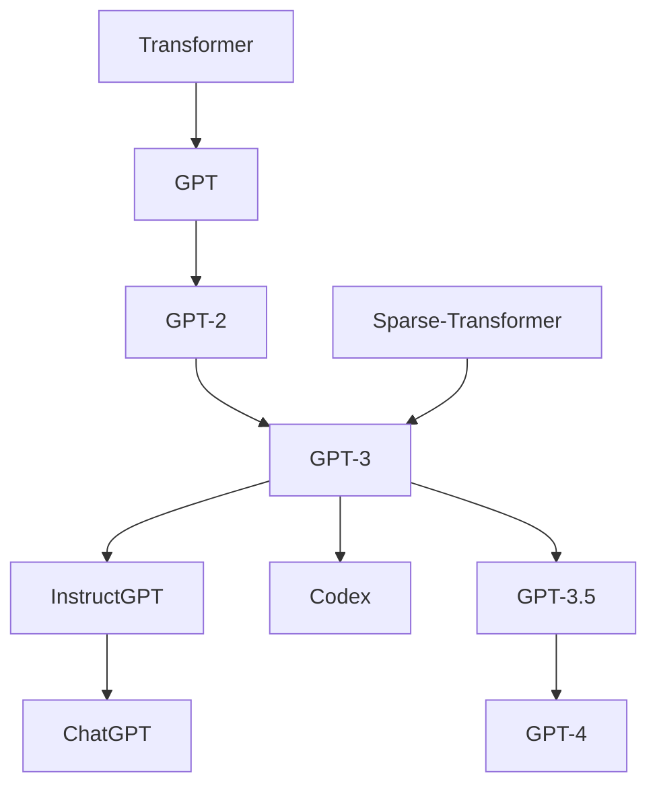

*[GPT](https://ja.wikipedia.org/wiki/GPT_(%E8%A8%80%E8%AA%9E%E3%83%A2%E3%83%87%E3%83%AB)) (2018.06.11 [OpenAI](https://ja.wikipedia.org/wiki/OpenAI))*
パラメータ数: 110M(12層)
[Improving Language Understanding by Generative Pre-Training](https://paperswithcode.com/paper/improving-language-understanding-by)
GPTの初期モデル。
TransformerのDecoderを用いて、大規模テキストデータで学習したものがGPTとなる。
Transformerが12層連なっているためモデルが大きい。

ELMoのLSTMは特徴抽出が十分でなかったため、Transformerを使用するGPTが考えられた。
しかし、双方向ではなくなり、後のBERTの登場につながった。
一方向から推測するので、BERTよりテキスト生成タスクに向いている。

BookCorpus 7000冊のデータ4.5GB を事前学習に用いた。

*[GPT-2](https://ja.wikipedia.org/wiki/GPT-2) (2019.02.14 OpenAI)*
パラメータ数: 1.5B(48層)
[Language Models are Unsupervised Multitask Learners](https://paperswithcode.com/paper/language-models-are-unsupervised-multitask)
GPT-1をそのまま10倍にスケールしたもの。
人間が読んでも違和感が少ない一貫した内容の文章を生成できるようになった。

WEBから収集した40GBのデータで学習した。

*[GPT-3](https://ja.wikipedia.org/wiki/GPT-3) (2020.05.28 OpenAI)*
パラメータ数: 175B(96層)
[Language Models are Few-Shot Learners](https://arxiv.org/abs/2005.14165)
GPT-3を超えたあたりでとても優秀になった。
このレベルになると微調整(Fine-Tuning)なしでも高い能力を発揮できる。
OpenAIが研究していたSparse Transformerの技術が取り込まれている。

WEBから収集した570GBのデータで学習した。
このデータはCommonCrawlをもとに、フィルタリング、重複削除、既知の高品質コーパスでの補完などが行われている。
約100万ドルかかったと報告されている。

OpenAIはGPT-2とは違い、GPT-3をClosed-Sourceとした。

[Scaling Laws for Neural Language Models](https://arxiv.org/abs/2001.08361)
OpenAIはTransformerの仕組みはスケーリング則に則り、大規模化が可能との論文を発表した。
パラメータ数N、データセットサイズD、学習計算量の3つの変数のべき乗則に従う。

[Are Emergent Abilities of Large Language Models a Mirage?](https://arxiv.org/abs/2304.15004)
モデル規模が大きくなった時、飛躍的にスコアが上がり、創発(新たな能力の獲得)が起こったと話題となった。
しかし、単にスコア用のテストの指標が非線形あるいは不連続であると述べられている。

*InstructGPT (2021.01 OpenAI)*
パラメータ数: 1.3B
[Training language models to follow instructions with human feedback](https://arxiv.org/abs/2203.02155)
GPT-3の小型版を使用して、RLHFを取り入れたモデル。
モデルを大きくするだけでは、人間の意図を適切にとらえることはできない。
175BのGPT-3よりも1.3BのInstructGPTの方が、優れた結果を示した。

[RLHF](https://en.wikipedia.org/wiki/Reinforcement_learning_from_human_feedback)
RLHF(Reinforcement Learning from Human Feedback)は、
人間からのフィードバックで微調整(Fine-tuning)する手法。

*[OpenAI Codex](https://ja.wikipedia.org/wiki/OpenAI_Codex) (2021.08 OpenAI)*
[Evaluating Large Language Models Trained on Code](https://arxiv.org/abs/2107.03374)
自然言語からプログラムのソースコードを生成するためのモデル。
GPT-3をプログラミングのソースコードで微調整したもの。

GitHub Copilotを動かしていた初期モデル
code-cushman-001

*GPT-3.5 (2022.03.15 OpenAI)*
初期バージョン
text-davinci-002
code-davinci-002

*GPT-3.5v2 (2022.11.28 OpenAI)*
改良バージョン
text-davinci-003
gpt-3.5-turbo 会話用、4kトークンまで対応。
gpt-3.5-turbo-16k 2023.06くらいに追加

GPT-3.5 TurboはGPT-3に比べてトークンあたりのコストが1/10と言われている。

*[ChatGPT](https://ja.wikipedia.org/wiki/ChatGPT) (2022.11.30 OpenAI)*
InstructGPTの兄弟モデルが使用されたチャットベースのサービス。
チャット向けに調整されている。
使用モデルは順次最新版へ更新されている。

APIは従量課金制。
Azure OpenAI Serviceからも各モデルのAPIを使用することができる。
なお、価格は同じで、レスポンスはAzureの方が早い模様。

ブラウザでの検索、コードの実行、マルチモーダルに対応した。

*[GPT-4](https://ja.wikipedia.org/wiki/GPT-4) (2023.03.14 OpenAI)*
パラメータ数: 非公表
マルチモーダル。
システムメッセージという仕組みを導入した。
司法試験や大学入試試験(SAT)で受験者の上位10%に入る成績を出して話題となった。

1億ドル以上かかったとされる。

[GPT-4 Technical Report](https://arxiv.org/abs/2303.08774)
モデル規模を拡大することで得られる効果は逓減すると発表された。

*GPT-4 Turbo (2023.11.06 OpenAI)*
2023.04までのデータで学習。
128kトークンに対応。
単一メッセージで複数のFunction callingに対応。
XMLなど特定の形式での返答の精度が向上。
JSONモードが追加。

同様にGPT-3.5 Turboも改良された。

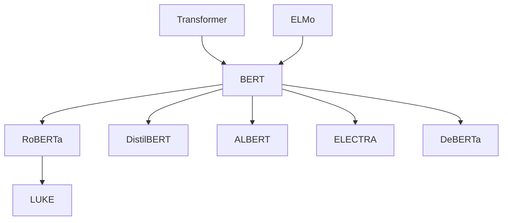

*[BERT](https://ja.wikipedia.org/wiki/BERT_(%E8%A8%80%E8%AA%9E%E3%83%A2%E3%83%87%E3%83%AB)) (2018.10.11 Google)*
パラメータ数: BERT-base=110M, BERT-large=340M
[BERT: Pre-training of Deep Bidirectional Transformers for Language Understanding](https://arxiv.org/abs/1810.04805)
GPTとは違い、TransformerのEncoderを使用し、文章の先頭と末尾からの双方向(Bidirectional)なAttention層が追加されている。
MLM(Masked Language Modeling)という手法を用いて、ラベリングなしの少ないデータから学習できた。
また文脈を予測するためにNSP(Next Sentence Prediction)という手法が用いられた。

GPT-1を超えて最高スコアを更新し、応用も効くため話題となった。
その後GPT-3が発表されるまでBERT系が多く登場することとなった。

*[RoBERTa](https://ai.facebook.com/blog/roberta-an-optimized-method-for-pretraining-self-supervised-nlp-systems/) (2019.07.26 Facebook)*
パラメータ数: RoBERTa-base=123M, RoBERTa-large=354M
[RoBERTa: A Robustly Optimized BERT Pretraining Approach](https://arxiv.org/abs/1907.11692)
BERTの仕組みをそのままに、パラメータの調整やデータ量を増大させたもの。

*DistilBERT (2019.08.02 [Hugging Face](https://ja.wikipedia.org/wiki/Hugging_Face))*
パラメータ数: 66M
BERTを蒸留したもの。
蒸留とは、大規模な教師モデルから小規模な生徒モデルを作成する手法。
DistilBERTはオリジナルのBERTと比べ約40%のパラメータを削減でき、性能を維持しつつ高速に動作するようになった。
しかし、蒸留の過程で情報が失われるため、より精度の高いものを求める場合はオリジナルが適している。

*[ALBERT](https://medium.com/syncedreview/googles-albert-is-a-leaner-bert-achieves-sota-on-3-nlp-benchmarks-f64466dd583) (2019.09.20 Google)*
パラメータ数: ALBERT-base=12M, ALBERT-large=18M, ALBERT-xlarge=60M, ALBERT-xxlarge=235M, ALBERT-xxlarge v2=233M
[ALBERT: A Lite BERT for Self-supervised Learning of Language Representations](https://arxiv.org/abs/1909.11942)
パラメータの因数分解と冗長性を排除することで、軽量化したモデル。

BERT-baseモデルを軽量化すると、12MパラメータのALBERT-baseモデルが作成できた。
これは89%の削減となるが、性能の低下はわずかだった。
モデルサイズが縮小されたので、より大規模な構成を行えるようになった。
ALBERT-xxlarge構成では最新のスコアを更新した。

*[ELECTRA](https://ai.googleblog.com/2020/03/more-efficient-nlp-model-pre-training.html) (2020.03.10 Stanford, Google)*
パラメータ数: ELECTRA-small=14M, ELECTRA-base=110M, ELECTRA-large=335M
[ELECTRA: Pre-training Text Encoders as Discriminators Rather Than Generators](https://arxiv.org/abs/2003.10555)
GANの手法を取り入れて、BERTの事前学習手法を改良した。
MLMは文章中のマスクした15%を学習できない問題点があった。
ELECTRAではReplaced Token Detectionという手法を用いて、より少ないデータで効率的な事前学習ができる。
RoBERTaの1/4の学習量で同等の精度を達成した。

*[DeBERTa](https://github.com/microsoft/DeBERTa) (2020.06.13 Microsoft)*
パラメータ数: 184M, 1.5B(48層)
[DeBERTa: Decoding-enhanced BERT with Disentangled Attention](https://arxiv.org/abs/2006.03654)
SuperGLUEのベンチマークで人間の基準を上回るスコアを記録し話題となった。

*LUKE (2020.10.02 山田郁哉)*
[LUKE: Deep Contextualized Entity Representations with Entity-aware Self-attention](https://arxiv.org/abs/2010.01057)
RoBERTaベース。
entity-aware self-attentionという仕組みを導入した。
日本人を中心としたチームが開発したモデル。
5つのタスクでスコアを更新し話題となった。
その後も日本語の最高スコアを維持し続けていた。

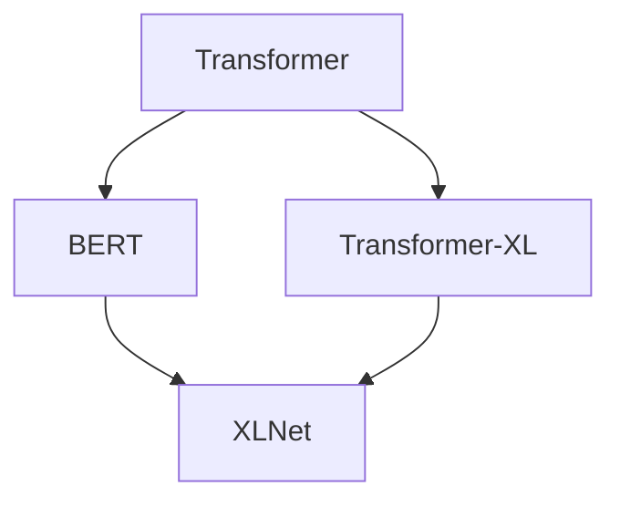

*Transformer-XL (2019.01.09 Google)*
パラメータ数: 257M
[Transformer-XL: Attentive Language Models Beyond a Fixed-Length Context](https://arxiv.org/abs/1901.02860)
Transformerではdot-product attentionの性質上、固定長パラメータしか扱えなかった。
そしてパラメータの全ての組み合わせを考慮するため、二乗の計算量が必要となり、長大なパラメータを持たせることは現実的ではなかった。
Transformer-XLではセグメントに分けて、長文に対応できるようにした。
またRelative Positional Encodingsという手法で単語の位置情報も学習に取り入れた。

*XLNet (2019.06.19 Google)*
[XLNet: Generalized Autoregressive Pretraining for Language Understanding](https://arxiv.org/abs/1906.08237)
パラメータ数: 340M
BERTの改良版。
20のタスクでBERTを超えたと話題になった。
しかし計算量も増大した。

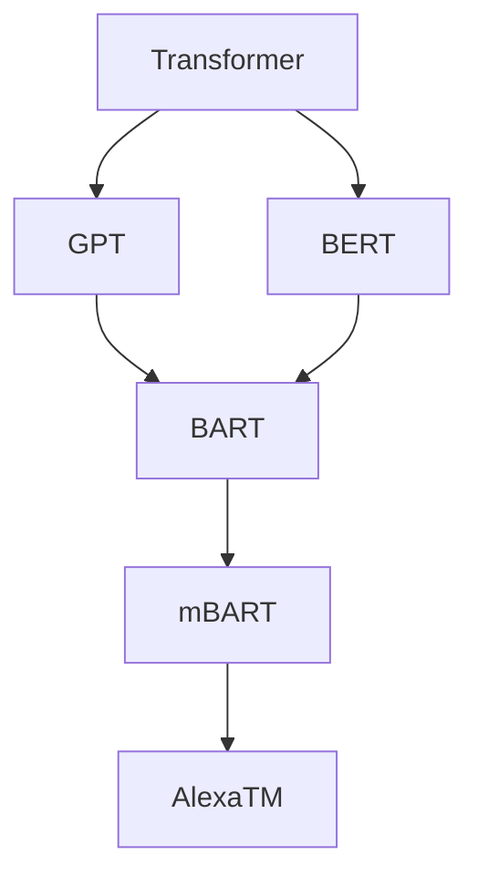

*BART (2019.10.29 Meta)*
パラメータ数: 140M
[BART: Denoising Sequence-to-Sequence Pre-training for Natural Language Generation, Translation, and Comprehension](https://arxiv.org/abs/1910.13461)
Bidirectional Auto-Regressive Transformerの略です。
BERTのEncoderとGPTのDecoderを組み合わせたもの。

*mBART (2020.01.22 Meta)*
Multilingual BART
25の言語で事前学習し、微調整されている。
翻訳などの多言語間のタスクで優れた性能を示した。

*AlexaTM (2022.08 Amazon)*
パラメータ数: 20B
[Amazon-Science/Alexa-Teacher-Models](https://github.com/amazon-science/alexa-teacher-models)
ノイズ除去(denoising)およびCasual LM(Prefix LMの一種)で訓練された。
T5ではPrefix LMよりもDec-Encタイプのほうがスコアが高かったが、ノイズ除去とCLMを組み合わせることでスコアを伸ばした。

1-shotの要約タスクで、PaLM 540Bを上回ったとされる。
0-shotでもGPT-3 175Bを上回ったとされる。

mC4の12言語で学習した。

*Amazon Titan (2023.04.14 Amazon)*
AWSのAIサービスであるBedrockとともに発表されたモデル。

GPT-4を超えるOlympusを開発中。
GPT-4は推定1Tパラメータを持つが、Olympusは2Tとなる。

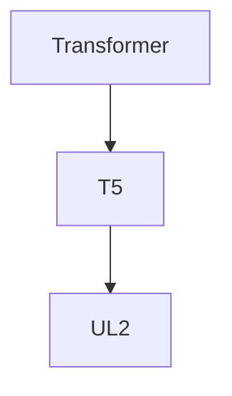

*T5 (2019.10.23 Google)*
パラメータ数: t5-base=223M, t5-large=739M, t5-3b=3B, t5-11b=11B
[Exploring the Limits of Transfer Learning with a Unified Text-to-Text Transformer](https://arxiv.org/abs/1910.10683)
Text-to-Text Transfer Transformerで、Tが5つあるのでT5と呼ばれる。
T5はオリジナルのTransformerと同様にEncoderとDecorderの両方を使用している。

多数のLLMが開発され、評価が困難になってきた。
現状で、何が最も転移学習を有効にしているのかを調査した結果、誕生したのがT5となる。

入力にはプレフィックスを用いると良好に機能する。

C4(Colossal Clean Crawled Corpus)データセットを作成して、学習に利用している。
C4は名前の通り、Common Crawlの巨大でクリーンなものと謳っている。
デフォルトだと800GBで提供されている。

*T5v1.1 (2020.08.06 Google)*
パラメータ数: small=77M, base=250M, large=800M, xl=3B, xxl=11B
活性化関数としてReLUではなくGEGLUを使用。
事前学習でのドロップアウトはオフにして、質の向上を目指す。

*mT5 (2020.08.22 Google)*
[mT5: A massively multilingual pre-trained text-to-text transformer](https://arxiv.org/abs/2010.11934)
Multilingual T5のこと。
微調整前のモデルとなる。

101の言語からなるmC4データセット約40TBで学習している。

*[UL2](https://ai.googleblog.com/2022/10/ul2-20b-open-source-unified-language.html) (2020.10.14 Google) Apache2.0*
パラメータ数: 20B
[UL2: Unifying Language Learning Paradigms](https://arxiv.org/abs/2205.05131)
T5v1.1と同じアーキテクチャを持つが、GEGLUではなく、Gated-SiLUを使用している。
ノイズ除去(denoising)することで精度を上げている。

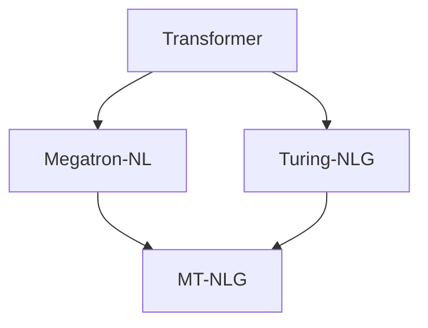

*Megatron-LM (2019.09.17 NVIDIA)*
パラメータ数: 8.3B
[GitHub - Megatron-LM](https://github.com/NVIDIA/Megatron-LM)
[Megatron-LM: Training Multi-Billion Parameter Language Models Using Model Parallelism](https://arxiv.org/abs/1909.08053)
モデルの垂直分割による並列化とAttentionの水平分割による並列化する方法。
GPT, BERT, T5 など様々なタイプのTransformerベースのモデルを並列化することができた。

*[Turing-NLG](https://www.microsoft.com/en-us/research/blog/turing-nlg-a-17-billion-parameter-language-model-by-microsoft/) (2020.02.13 Microsoft)*
パラメータ数: 17B
モデル自体を複数のGPUのメモリに分割して学習。

*MT-NLG (2021.10.12 Microsoft, NVIDIA)*
パラメータ数: 530B(105層)
[Using DeepSpeed and Megatron to Train Megatron-Turing NLG 530B, A Large-Scale Generative Language Model](https://arxiv.org/abs/2201.11990)
MicrosoftとNVIDIAの研究協力のもと作成されたモノリシックでは最大規模のモデルとなる。
GPT-3の3倍のパラメータ数となり、様々なタスクですばらしい精度を発揮した。
MegatronやDeepSpeedの仕組みは後の様々なLLMs(GPT-NeoXやBLOOMなど)で使われるようになった。

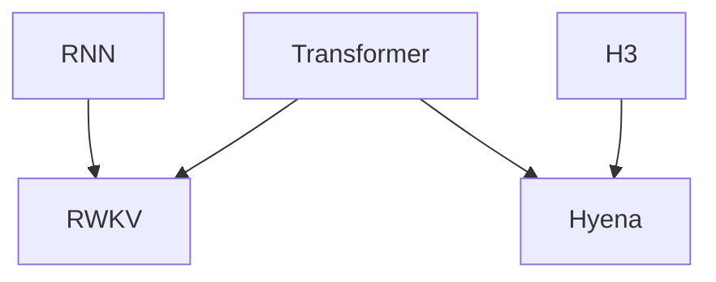

*RWKV-LM (2021.08.13 BlinkDL) Apache2.0*
パラメータ数: 7B, 14B
[BlinkDL/RWKV-LM](https://github.com/BlinkDL/RWKV-LM)
RWKVの名前の由来は4つの重要なパラメータを並べたもの。ルワクフと発音する。
RNNとTransformerのいいとこどり。
GPTのように並列で学習したが、実行はRNNなので少メモリで実行できる。
RNNで高い性能を示し話題となった。

14Bのモデルを訓練するにはA100 GPUで22,436時間かかったとされる。

AlpacaやShareGPTで微調整されたRavenというモデルもある。

*Hyena (2023.02.21) Apache2.0*
[Hyena Hierarchy: Towards Larger Convolutional Language Models](https://arxiv.org/abs/2302.10866)
Transformerに変わる新しい仕組みH3(Hungry Hungry Hippos)が使われている。

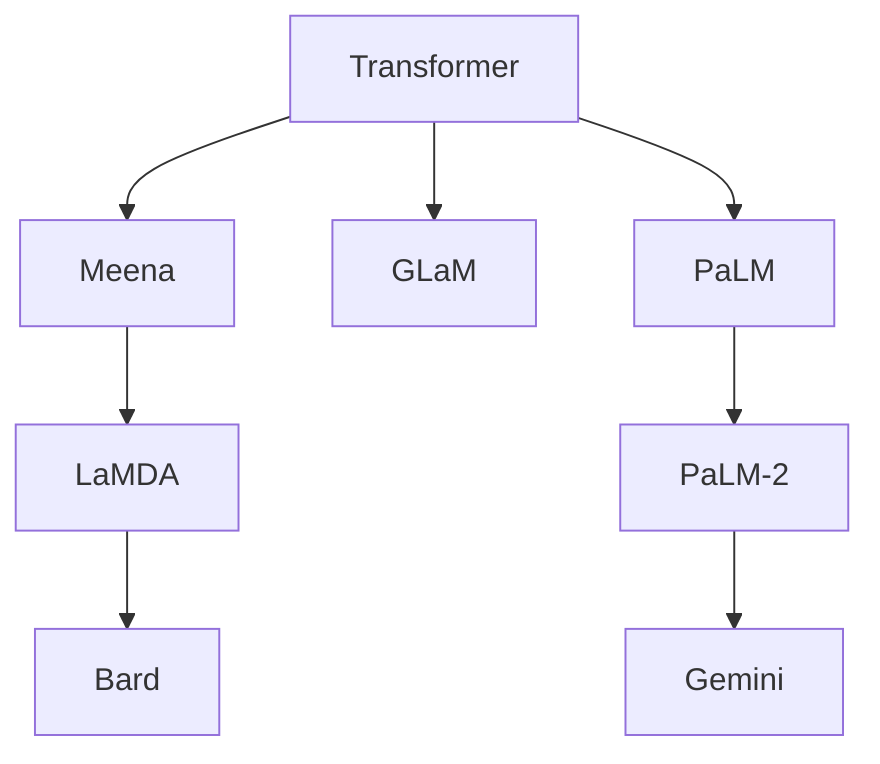

*Meena (2020.01.28 Google)*
パラメータ数: 2.6B
[Towards a Human-like Open-Domain Chatbot](https://arxiv.org/abs/2001.09977)
[The Evolved Transformer](https://arxiv.org/abs/1901.11117)
Googleが開発したチャットボット。
１つのEvolved Transformer Encoderと13のDecoderからなる。
LaMDAの前身。

パブリックドメインのソーシャルメディアの会話から341GBのテキストでトレーニングされている。

*[LaMDA](https://ja.wikipedia.org/wiki/LaMDA) (2021.05.18 Google)*
パラメータ数: 137B
[LaMDA: Language Models for Dialog Applications](https://arxiv.org/abs/2201.08239)
もともとはMeenaとして開発されたが、のちにLaMDAとして発表された。
Googleの社員が意識が宿ったと述べて話題となった。

1.56T wordsで学習した。

*[Bard](https://ja.wikipedia.org/wiki/Bard) (2023.02.06 Google)*
ChatGPTのに対抗して、LaMDAを搭載したチャットベースのサービス。
使用モデルはPaLM、PaLM2、Geminiと順次アップデートされていっている。

2023.04.10 PaLM
2023.05.10 PaLM2
2023.12.06 Gemini

*GLaM (2021.12.09 Google)*
パラメータ数: 1.2T(97B)
[GLaM: Efficient Scaling of Language Models with Mixture-of-Experts](https://arxiv.org/abs/2112.06905)
Generalist Language Modelの略。
特定の入力に特化したExpertをサブモデルに持っている。
そのため推論時には、2つのExpert層のみ、970億(1.2Tの8%)のサブネットワークのみが活性化される。
この2つだけ活性化させるスパース性を利用して効率的に学習、実行できるようにした。
活性化時のパラメータはGPT-3より少ないが、GPT-3と遜色ない性能を発揮することができた。

*[PaLM](https://ja.wikipedia.org/wiki/PaLM) (2022.04.04 Google)*
パラメータ数: 540B
[PaLM: Scaling Language Modeling with Pathways](https://arxiv.org/abs/2204.02311)
Pathways Language Modelの略。
1つのモデルで何でもできる汎用(Pathways)をめざしたモデル。
GPTと同じDecoderタイプのTransformerを採用している。

規模が大きくなるにつれて、機能が解放されていくイメージ。
OpenAIのスケーリング則を追検証した形となる。
Gopherなどの先行LLMではモデル規模を拡大しても性能向上の恩恵はあまり見られなかった。

*Minerva (2022.07.03 Google)*
[Solving Quantitative Reasoning Problems with Language Models](https://arxiv.org/abs/2206.14858)
PaLMベースのMinervaが三角関数の文章問題を解いて話題となった。
MATHデータセットのPaLMの正答率が8.8%だったのに対して、Minervaは50.3%と飛躍的に向上している。

*PaLM-E (2023.03.06 Google)*
パラメータ数: 562B
[GitHub - PaLM-E](https://palm-e.github.io/)
[PaLM-E: An Embodied Multimodal Language Model](https://arxiv.org/abs/2303.03378)
PaLMに視覚処理(Vision Transformer)を組み込んだモデル。
視覚情報を基に様々なタスクをこなせるようになった。

*PaLM 2 (2023.5.11 Google)*
パラメータ数: 非公表
Google I/Oで発表されたPaLMの次世代モデル。
Bardをはじめ、すでに多くのGoogleのサービスに使用されている。
GPT-4と同水準。

*[Gemini](https://en.wikipedia.org/wiki/Gemini_(language_model)) (2023.12.06 Google)*
Googleが開発したマルチモーダル対応のモデル。
Adob​​e Fireflyとの提携も発表されていたので、Geminiと連携している？
GPT-4よりよいスコアだと発表されている。

4つのバージョンがある。
Gemini Nano-1: 1.8B、低メモリデバイス用、4bit量子化
Gemini Nano-2: 3.25B、高メモリデバイス用、4bit量子化
Gemini Pro: 通常利用用、Turboのようなもの
Gemini Ultra: 複雑な処理用

Jaxでプログラム。
Pathwaysモデル。

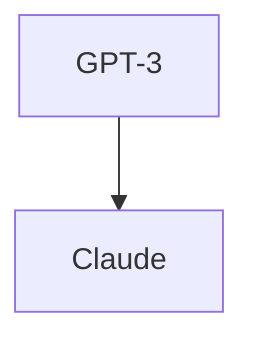

*[Claude](https://en.wikipedia.org/wiki/Anthropic#Claude) (2023.03.14 Anthropic)*
元OpenAIのチームが設立したAIスタートアップの会社により開発されたモデル。
MicrosoftがOpenAIに出資してChatGPTがAzure上で動いているのに対し、
GoogleがAnthropicに出資してGoogle Cloud上で動いている。
Claude1の性能は、GPT-3.5とGPT-4の中間と言われている。

2023.05.11には入力トークンを9kから100kに拡張したことを発表した。
GPT-4は32kトークンとなるので、約3倍の長さの入力を受け付けられるようになった。

*Claude 2 (2023.07.11 Anthropic)*
100kトークンまで対応。(Pro限定)
多言語対応になった。
安全性が増した。

2023.10.16 から日本でも使えるようになった。

*Claude 2.1 (2023.11.21 Anthropic)*
200kトークンまで対応。(Pro限定)
ハルシネーションが半減。

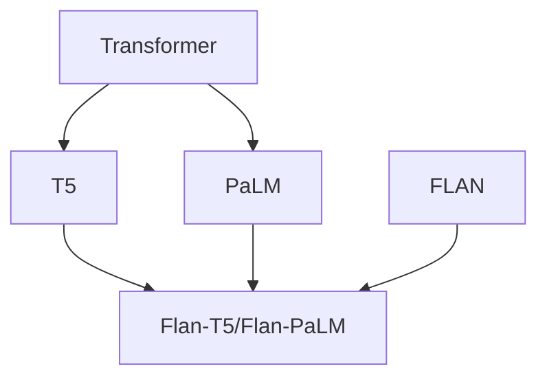

*FLAN (2021.10.06 Google)*
パラメータ数: 137B
[google-research/FLAN](https://github.com/google-research/FLAN/tree/main)
[Finetuned Language Models Are Zero-Shot Learners](https://arxiv.org/abs/2109.01652)
微調整によりゼロショットの能力を向上させるために作成されたモデル。

[The Flan Collection: Designing Data and Methods for Effective Instruction Tuning](https://arxiv.org/abs/2301.13688)
Flan Collectionは指示調整のための大規模データセット。
1800のタスク、1500万件のデータからなる。

*Flan-T5/Flan-PaLM (2022.12.06 Google) Apache2.0*
[Scaling Instruction-Finetuned Language Models](https://arxiv.org/abs/2210.11416)
指示調整タスクのFlan Collectionを使って微調整したT5とPaLMのモデル。

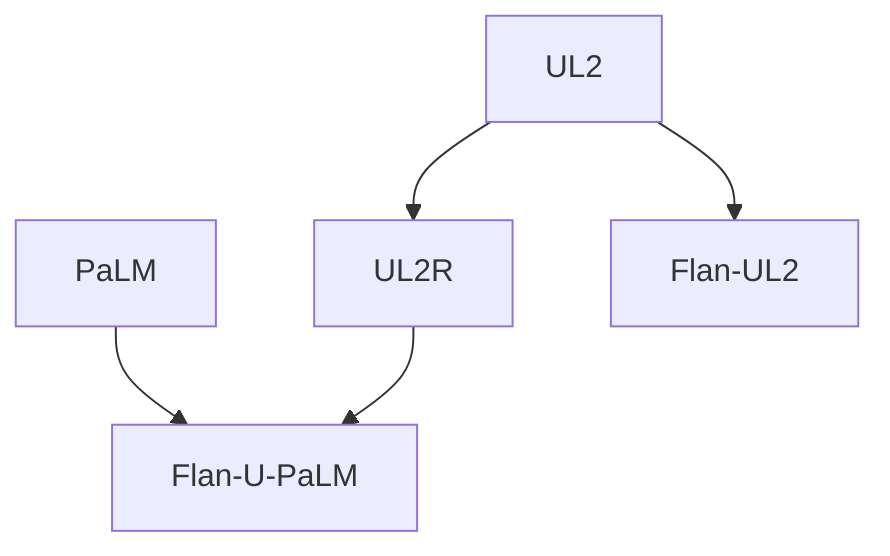

*[UL2R](https://ai.googleblog.com/2022/11/better-language-models-without-massive.html) (2022.05.22 Google)*
パラメータ数: 137B
UL2Rは様々なサイズの言語モデルを指示微調整することを目的としている。

*Flan-U-PaLM (2022.11.29 Google)*
パラメータ数: 540B
FlanとUL2RでPaLMを微調整したもの。
U-PaLMやFlan-PaLMを上回るパフォーマンスを発揮した。
MMLUベンチマーク75.4%でスコアを更新した。

*[Flan-UL2](https://www.yitay.net/blog/flan-ul2-20b) (2023.03.03 Google) Apache2.0, 商用可*
パラメータ数: 20B / Finetuned, Instruct tuned
指示調整タスクのFlan Collectionを使って微調整したUL2モデル。
GoogleがLLaMAに対抗するようにオープンソースで公開した。

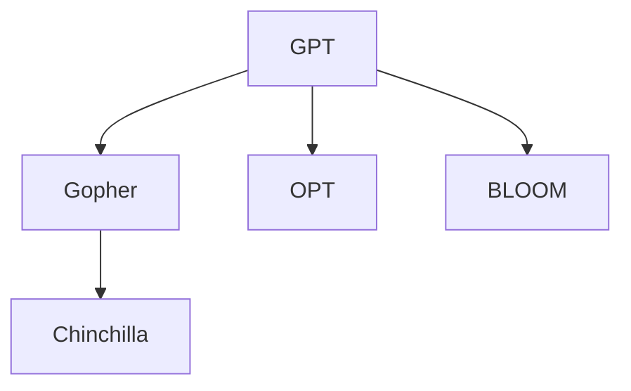

*Gopher (2021.12.08 DeepMind)*
パラメータ数: 280B
[Scaling Language Models: Methods, Analysis & Insights from Training Gopher](https://arxiv.org/abs/2112.11446)
DeepMindの動物シリーズのひとつ目で、Gopherはホリネズミを意味する。
124種中100種のタスクで最高記録を更新して話題となった。

Massive Textと呼ばれる10.5TBの英語テキストデータを作成し、学習に用いた。

QAに特化したGopherCiteというモデルもある。

*[Chinchilla](https://en.wikipedia.org/wiki/Chinchilla_AI) (2022.03.29 DeepMind)*
パラメータ数: 70B
[Training Compute-Optimal Large Language Models](https://arxiv.org/abs/2203.15556)
言語モデルのパラメータとサイズ、トレーニングに使用されるデータ量を見直すことで、GPT-3, Gopher, MT-NLGの性能を上回った。

SparrowはChinchillaのプロンプトバージョン。
RLHFで微調整されている。

*Flamingo (2022.04.28 DeepMind)*
パラメータ数: 80B
[Flamingo: a Visual Language Model for Few-Shot Learning](https://arxiv.org/abs/2204.14198)
FlamingoはChinchillaに画像エンコーダーをつないだもの。
画像からテキストを生成できる。

*[Gato](https://en.wikipedia.org/wiki/Gato_(DeepMind)) (2022.05.12 DeepMind)*
Gatoはスペイン語で雄ネコ。
マルチモーダルなモデルでロボットなどの行動生成まで行える。

*AlphaCode (2022.02.02 DeepMind)*
パラメータ数: 41.4B
[Competition-Level Code Generation with AlphaCode](https://arxiv.org/abs/2203.07814)
DeepMindのAlphaGoやAlphaZeroのAlphaシリーズのコード生成版。
OpenAI Codexを競技プログラミングレベルに引き上げたもの。

*AlphaCode2 (2023.12.07 DeepMind)*
Gemini Proベース。
競技プログラミングで上位15%に入った。
AlphaCode1だと50%くらいだった。

*[OPT-175B](https://ai.facebook.com/blog/democratizing-access-to-large-scale-language-models-with-opt-175b/) (2022.05.03 Meta) 非商用*
パラメータ数: 1.3B, 2.7B, 6.7B, 13B, 30B, 66B, 175B / Finetuned, Instruct tuned
[OPT: Open Pre-trained Transformer Language Models](https://arxiv.org/abs/2205.01068)
[facebookresearch/metaseq//OPT](https://github.com/facebookresearch/metaseq/tree/main/projects/OPT)
Open Pre-trained Transformersのモデルのひとつ。 

FlexGenを使えば、GPUのVRAMを効率的にCPUのRAMにスワップできる。
つまり、175Bに必要な400GB近くのメモリを通常のRAMで動かすことができる。
とはいえ、動かすことができるだけなので、実行速度に劣るため流行らなかった。

*[OPT-IML](https://github.com/facebookresearch/metaseq/tree/main/projects/OPT-IML)*
[OPT-IML: Scaling Language Model Instruction Meta Learning through the Lens of Generalization](https://arxiv.org/abs/2212.12017)
OPTをInstructionチューニングしたもの。

*Galactica (2022.11.15 Meta)*
科学技術系のコーパスから学習されたモデル。
ハルシネーションが原因でわずか3日で公開が中止された。

ハルシネーション(Hallucination)は、幻覚とも呼ばれ、LLMの仕組み上、もっともらしいウソが構築されてしまう現象のこと。

*[BLOOM](https://bigscience.huggingface.co/blog/bloom) (2022.07.06 BigScience) OSS*
パラメータ数: 1.1B, 1.7B, 3B, 7.1B, 176B / Finetuned
[BLOOM: A 176B-Parameter Open-Access Multilingual Language Model](https://arxiv.org/abs/2211.05100)
BigScience Large Open-Science Open-Access Multilingual Language Modelの略。
70以上の国と250以上の機関の1000人を超える研究者の協力で作成された多言語LLM。
46の自然言語と13のプログラミング言語を扱える。

学習にはNVIDIA A100が384枚で4か月かかったとされる。
コストは200万ドル～500万ドルと推定される。

GPT-3と同様のパラメータを持つ軽量化モデルでも329GBあるので、動かすだけでも24GBのGPUが14枚以上必要とされる。
1Bのモデルだと12GBのGPUで動かすことができる。

176Bモデルを作成後、bitsandbytesを用いて8bit量子化が検討された。
176Bモデルの329GBが8bit量子化で200GBで動作可能となる。

*BLOOM+1 (2022.10.19 BigScience)*
[BLOOM+1: Adding Language Support to BLOOM for Zero-Shot Prompting](https://arxiv.org/abs/2212.09535)
BLOOMをゼロショット用に微調整したもの。

*BLOOMZ (2022.11.03 BigScience)*
[bigscience-workshop/xmtf](https://github.com/bigscience-workshop/xmtf)
[Crosslingual Generalization through Multitask Finetuning](https://arxiv.org/abs/2211.01786)
BLOOMを微調整したもので、多言語一般化を実現したもの。

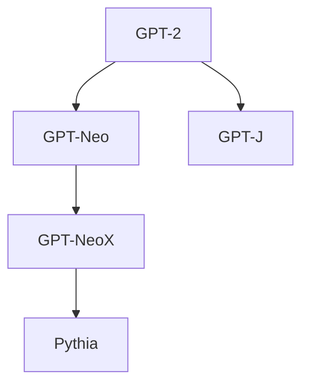

*GPT-Neo (2021.03.21 [EleutherAI](https://en.wikipedia.org/wiki/EleutherAI), Together) Apache2.0*
パラメータ数: 125M, 1.3B, 2.7B / Finetuned
GPT-3がClosed-Sourceだったので、Open-SourceのGPT-3を作成することを目的としたモデル。
GPT-2のクローンを作ろうとしたものをもとにしている。
256トークンのウィンドウサイズに区切ったLocal Attentionを使用している。
Local Attentionはウィンドウ外へアクセスできないため、パフォーマンスとのトレードオフとなる。

The Pileデータセット(800GB)で訓練された。
The PileはLLM用に多様性のある22のデータセットの組み合わせで構成されている。

*[GPT-J](https://en.wikipedia.org/wiki/GPT-J) (2021.06.09 EleutherAI) Apache2.0*
パラメータ数: 6B / Finetuned, Instruct tuned
JAXライブラリを使用していたのでGPT-Jと名づけられた。
公開された当時は、GPT-3スタイルのモデルとして世界最大のものだった。

The Pileデータセットで訓練された。

*GPT-NeoX (2022.02 EleutherAI)*
パラメータ数: 20B(44層)
EleutherAIが公開したLLM学習用のライブラリ、およびそれを用いてトレーニングされたモデル。
Microsoft DeepSpeedを使って学習を高速化している。
Nvidia Megatronを使って分散して学習した。
公開された当時は、GPT-3スタイルのモデルとして世界最大のものだった。

*Pythia (2023.02.13 EleutherAI, Together) Apache-2.0*
パラメータ数: 70M-12B および各モデルの154のチェックポイント / Finetuned
[Pythia: A Suite for Analyzing Large Language Models Across Training and Scaling](https://arxiv.org/abs/2304.01373)
[Emergent and Predictable Memorization in Large Language Models](https://arxiv.org/abs/2304.11158)
[EleutherAI/pythia](https://github.com/EleutherAI/pythia)

LLMの訓練とスケーリングを分析するために作成されたため、多数のチェックポイントを残している。

The Pileおよび重複排除されたデータセットで訓練された。

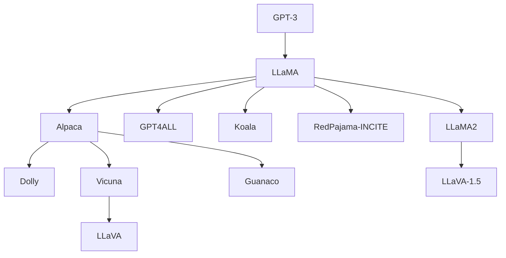

*[LLaMA](https://ai.facebook.com/blog/large-language-model-llama-meta-ai/) (2023.02.24 Meta) 非商用*
パラメータ数: 7B, 13B, 33B, 65B / Finetuned
[LLaMA: Open and Efficient Foundation Language Models](https://arxiv.org/abs/2302.13971)
[facebookresearch/LLaMA](https://github.com/facebookresearch/llama)

65Bと33Bは1.4兆トークンでトレーニングされている。
7Bは1兆個のトークン。
LLaMA-13BはGPT-3(175B)よりほとんどのベンチマークで優れている。

訓練費用は100万ドル。
2048個のA100 80GB GPUで21日間トレーニングしたと報告されている。

*[LLaMA 2](https://ai.meta.com/llama/) (2023.07.18 Meta) 商用可*
パラメータ数: 7B, 13B, 70B / Finetuned
商用利用可能だが、月間ユーザーが7億人を超えると追加ライセンスが必要となる。

2Tトークンで訓練された。
コンテキスト長は4kトークン。

*Code LLaMA (2023.08.24 Meta)*
LLaMA2をベースに500BトークンのCodeで訓練された。

*[Alpaca](https://crfm.stanford.edu/2023/03/13/alpaca.html) (2023.03.13 Stanford) Apache-2.0, 非商用*
パラメータ数: 7B / Finetuned, Instruct Tuned
[tatsu-lab/Stanford Alpaca](https://github.com/tatsu-lab/stanford_alpaca)
LLaMA 7BモデルをChatGPTとの1.3万回の会話データで微調整(Fine-tuning)したもの。
もとになったLLaMAが研究目的限定で、さらにOpenAIの利用規定で、ChatGPTの出力をもとに、ChatGPTに対抗できるAIを作ってはいけない制約があるので、研究目的以外に使用することはできない。

[スタンフォード大学がChatGPTレベルのAIを600ドル未満で構築](https://texal.jp/2023/03/21/stanford-university-builds-chatgpt-level-ai-for-less-than-600/)
A100 8枚で3hかかった。

*[Dolly](https://www.databricks.com/blog/2023/04/12/dolly-first-open-commercially-viable-instruction-tuned-llm) (2023.03.24 Databricks) MIT, 非商用*
パラメータ数: 3B, 12B / Finetuned, Instruct tuned
AlpacaをChatGPTの出力で微調整したもの。
そのため、LLaMAの制限とChatGPTの制限がある。
LLaMAの制限は商用利用禁止、ChatGPTは競合モデルの作成の禁止。

わずか30ドルで訓練された。

*GPT4ALL (2023.03.26 Nomic AI) MIT, 非商用*
パラメータ数: 7B, 13B / Finetuned, Instruct tuned
[nomic-ai/GPT4All](https://github.com/nomic-ai/gpt4all)
gpt-3.5-turboを利用して収集したデータを用いてLLaMAを微調整したもの。
ローカルで単一GPUで動くチャットボットを構築することを目指した。
GPUなしのCPUのみでも動かすことができる。
GPT4ALL自体はMITだが、モデルはLLaMAのライセンスを継承するため商用利用は禁止。

*[Vicuna](https://lmsys.org/blog/2023-03-30-vicuna/) (2023.03.30 UC Berkeley, ...) 非商用*
パラメータ数: 13B / Finetuned, Instruct tuned
AlpacaをShareGPTのデータで微調整したもの。
ShareGPTはChatGPTの対話データを収集したもの。
ChatGPTの90%程度の性能を達成できるとされる。

*[Koala](https://bair.berkeley.edu/blog/2023/04/03/koala/) (2023.04.03 UC Berkeley) 非商用*
パラメータ数: 7B, 13B / Finetuned, Instruct tuned
カリフォルニア大学バークレー校のアカデミックチームによる会話データでLLaMAを微調整したモデル。

*[LLaVA](https://github.com/haotian-liu/LLaVA) (2023.04.17) 非商用*
Vicunaベースで画像を認識できるようにしたもの。

*LLaVA-1.5 (2023.10.05)*
LLaMA2に視覚エンコーダー(CLIP ViT-L/14)を組み合わせたもの。

*[RedPajama-INCITE](https://www.together.xyz/blog/redpajama-models-v1) (2023.05.05 Together) Apache2.0, 商用可*
パラメータ数: 3B, 7B / Finetuned, Instruct tuned
名前の由来はLlama Llama Red Pajamaから。
LLaMAを忠実に再現することを目的としたモデル。
RedPajama-Data-1Tという高品質、広範囲のデータセットを作成した。

3Bモデルは同パラメータ帯の他と比べて優秀で、RTX 2070でも動作する。
7BモデルはPythia 7Bを上回る性能を示したとされる。

*Guanaco (2023.03.18) 非商用*
パラメータ数: 7B, 13B, 33B, 65B / Finetuned, Instruct tuned
[Guanaco - Generative Universal Assistant for Natural-language Adaptive Context-aware Omnilingual outputs](https://guanaco-model.github.io/)
[JosephusCheung/Guanaco](https://huggingface.co/JosephusCheung/Guanaco)
LLaMA 7BモデルをAlpacaデータセットと日本語を含む多言語(Multilingual)で微調整(Fine-tuning)したもの。
ロールプレイをサポート。
Multimodal Visual Question Answering (VQA)をサポート。

ワシントン大学(UW)のGuanacoが発表される以前より存在している。

*UW Guanaco (2023.05.23 UW) MIT, 非商用*
[QLoRA: Efficient Finetuning of Quantized LLMs](https://arxiv.org/abs/2305.14314)
[artidoro/QLoRA](https://github.com/artidoro/qlora)
LLaMA1のちにLLaMA2を微調整したモデルとなる。
4bitのNormalFloat型というものを用いることで従来よりも精度を保ちつつメモリ使用量を大幅に削減できた。
bitsandbytesやPEFTを使用している。

65Bの微調整に780GB必要だったが、QLoRAで48GBとなった。
33Bのモデルを24GBのGPUで12時間以内に微調整できた。

*[Gorilla](https://gorilla.cs.berkeley.edu/) (2023.05.26 UC Berkeley, Microsoft)*
適切なAPIを呼び出せるモデル。
TorchHub, TensorFlowHub, HuggingFaceのデータセットで学習している。

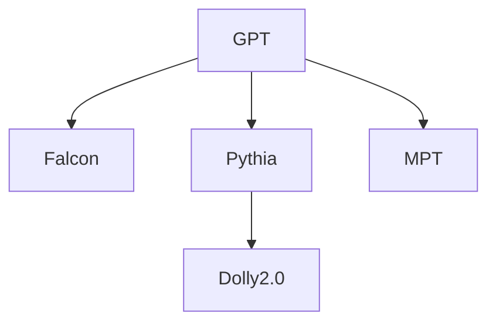

*[Falcon-LLM](https://techversions.com/news/falcon-big-language-model-is-introduced-by-the-uaes-technological-innovation-institute/) (2023.03.17 UAE TII)*
パラメータ数: 7B, 40B / Non-tuned
[The RefinedWeb Dataset for Falcon LLM: Outperforming Curated Corpora with Web Data, and Web Data Only](https://arxiv.org/abs/2306.01116)
Webからのデータだけでも適切なフィルタリングと重複排除により、性能を高めることに成功した。
Hugging Faceのリーダーボードの1位を獲得し話題となった。
2023.05.31 にモデルをApache-2.0で公開した。

Common Crawlの5T tokensから厳選した600B tokensのRefinedWebコーパスを作成した。

*[Falcon-180B](https://falconllm.tii.ae/falcon-180b.html) (2023.09.08 UAE TII)*
商用利用可能だが、ホスティングは除く。
HuggingFace登場時には、Leaderboardの最高得点を更新した。

[Fast Transformer Decoding: One Write-Head is All You Need](https://arxiv.org/abs/1911.02150)
Munti-query attentionを採用することで、Key-Valueキャッシュを共有化し、メモリ消費量を抑えている。
7Bを動作させるにはGPU 15GB程度が必要。
40Bを動作させるにはGPU 90GBが必要。

学習はAWS上で384 GPUで二か月かかったとされる。

*Dolly 2.0 (2023.04.26 Databricks) 商用可*
パラメータ数: 12B
Pythiaベースのモデル。
Databricksは自社の社員による1.5万回の会話データセットを作り、LLaMAとChatGPTの制限をはずし、商用利用可能としてDolly 2.0を公開した。

*[MPT-7B](https://www.mosaicml.com/blog/mpt-7b) (2023.05.05 MosaicML) Apache-2.0, 商用可*
パラメータ数: 7B / Finetuned, Instruct tuned
ALiBiのおかげで84kまで入力できる。
FlashAttentionとFasterTransformerを使用している。

商用利用が可能なオープンソースのモデル。
テキストとコードの1Tのトークンで訓練された。
440のGPUで9.5日間かけて訓練された。
200万ドル(約3,000万円)かかったとされる。


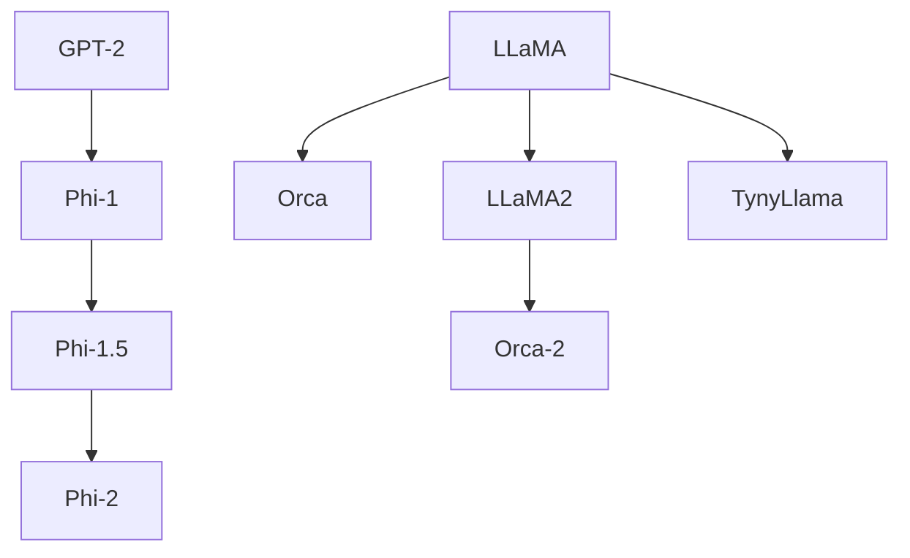

*[phi-1](https://huggingface.co/microsoft/phi-1) (2023.06.21 Microsoft)*
パラメータ数: phi-1-small=350M, phi-1-base=1.3B, phi-1=1.3B
[Textbooks Are All You Need](https://arxiv.org/abs/2306.11644)
Pythonコード生成向けのモデル。
教科書品質のデータセットを用いることにより、小さいサイズにもかかわらずHumanEvalで好成績を残したとして話題となった。
モデルのパラメータ数を増やす代わりに、データの品質を高めることでパフォーマンスが上がる。
baseモデルは未調整のものとなり、そこから微調整することにより20%は評価が向上している。
DeepSpeedとFlashAttentionが使用されている。

HumanEvalはコードを評価する指標となる。
GPT-4の67%に比べ、phi-1(1.3B)で50.6%となる。
さらに小さいphi-1-small(350M)でも45%を達成している。
同水準の他のモデルはパラメータ数は100倍、1000倍以上となっている。

WEBから厳選した6Bトークンの教科書品質のデータセットで事前訓練し、GPT-3.5から生成した1Bのトークンで微調整されている。
A100 8台で4日間トレーニングされた。

GPT-3.5からの高品質なトークンがなければ達成できなかったとされる。
しかし他のLLMからのデータを学習することで、データポイズニングが問題となる可能性もある。

[The Curse of Recursion: Training on Generated Data Makes Models Forget](https://arxiv.org/abs/2305.17493)
またLLMからのデータばかりを学習することでモデル崩壊が起こることも指摘されている。

*[phi-1.5](https://huggingface.co/microsoft/phi-1_5) (2023.09.15 Microsoft)*
パラメータ数: 1.3B
[Textbooks Are All You Need II: phi-1.5 technical report](https://arxiv.org/abs/2309.05463)
150Bトークンのデータセットで、32 x A100-40G で8日間かかった。

*[phi-2](https://www.microsoft.com/en-us/research/blog/phi-2-the-surprising-power-of-small-language-models/) (2023.12.11 Microsoft)*
パラメータ数: 2.7B
1.4Tトークンのデータセットで、96 x A100-80G で14日間かかった。
2kトークンのコンテキストを処理できる。

*[Orca](https://www.microsoft.com/en-us/research/project/orca/) (2023.06.05 Microsoft)*
パラメータ数: 13B
[Orca: Progressive Learning from Complex Explanation Traces of GPT-4](https://arxiv.org/abs/2306.02707)
10B以下の小型モデルを研究するためのプロジェクト。

*Orca-2 (2023.11.18 Microsoft)*
パラメータ数: 7B, 13B
[Orca 2: Teaching Small Language Models How to Reason](https://arxiv.org/abs/2311.11045)
LLaMA2の微調整版。

*TinyLlama-1.1B (2023.09.01)*
LLaMAモデルを3Tトークンで学習することを目的としたモデル。
ChinChillaのスケーリング則からは外れるが、各種スコアの上昇が確認されている。
16 x A100 40GB で90日間かけて学習する予定。

```mermaid
flowchart

GPT --> Mistral --> Mixtral
```

*[Mistral-7B](https://mistral.ai/news/announcing-mistral-7b/) (2023.09.27 Mistral AI) Apache 2.0*
本当のオープンソースとして利用できるとして話題となった。
コード生成に向いているモデルであり、7BパラメータでありながらLLaMA2-13BやLLaMA-34Bを上回ったとされる。
GQA(Grouped-Query Attendance)により高速な推論が可能。
SWA(Sliding-Window Attention)により長いシーケンスを省コストで処理できる。

派生で有名なものとしてOpenHermesなどが挙げられる。

*[Mixtral-8x7B](https://mistral.ai/news/mixtral-of-experts/) (2023.12.11 Mistral AI) Apache 2.0*
Mistral-7Bを元に、Feed forwardブロックを8倍に拡張したモデル。
SMoE(Sparse-Mixture-of-Exparts)により、2つのブロックのみ利用して推論する。
複数のExpartブロックを搭載する手法はGLaMで使われていた。
32kトークンまで処理可能。

```mermaid
flowchart

GPT-NeoX --> OpenCALM
GPT-NeoX --> Japanese-GPT-NeoX
LLaMA --> PLaMo
LLaMA --> CALM2
```

*[OpenCALM](https://www.cyberagent.co.jp/news/detail/id=28817) (2023.05.11 サイバーエージェント) CC4.0*
パラメータ数: 160M, 400M, 830M, 1.4B, 2.7B, 6.8B / Non-tuned
サイバーエージェントが公開した微調整前の日本語モデル。
CALMはCyberAgentLMのこと。
GPT-NeoXを使用。
Hugging FaceのページにはOpenCALM-XXをファインチューニングしたものと書かれている？

*Japanese-GPT-NeoX (2023.05.26 りんな)*
パラメータ数: 3.6B(Base), 3.6B(SFT)
りんなが公開した日本語モデル。

*[PLaMo](https://tech.preferred.jp/ja/blog/llm-plamo/) (2023.09.28 PFN) Apache 2.0*
パラメータ数: 13B
高い日本語性能と、そこそこの英語性能を備えたモデル。

*[CALM2](https://www.cyberagent.co.jp/news/detail/id=29479) (2023.11.02 サイバーエージェント) Apache 2.0*
パラメータ数: 7B(Base), 7B(Chat)
LLaMAベースだが、日本語を追加学習したわけではなく、日本語データセットを用意して再構築したものとなる。
32kトークンに対応。

```mermaid
flowchart

LLaMA --> LLaMA2 --> ELYZA-japanese-LLaMA2
LLaMA2 --> Youri-7B
```

*ELYZA-japanese-Llama-2-7b (2023.08.29 ELYZA)*
LLaMA2をもとに日本語で追加学習を行ったもの。
日本語語彙を増やして性能を上げたモデルがある。

*[Youri-7B](https://rinna.co.jp/news/2023/10/20231031.html) (2023.10.31 rinna)*
Youriは妖狸(ようり)からつけられた。
LLaMA2をもとに日本語で追加学習を行ったもの。
4bit量子化モデルもあるので[ローカルで動かしやすい](https://internet.watch.impress.co.jp/docs/column/shimizu/1533974.html)。

## LLMを取り巻くフレームワークやツール

### MLフレームワークや基本ライブラリ

*PyTorch*
有名どころ その1。

*TensorFlow (Google)*
有名どころ その2。

*JAX*
水平スケーリングに対応した、NumPyに代わるPythonライブラリ。
通常はPyTorchやTensorFlowを使用すればよいが、一部のアルゴリズムは、NumPyで書かれていることがある。
NumPyの代わりにJAXを使うことでマルチGPU(TPU)に対応できる。

*[NeMo](https://www.nvidia.com/ja-jp/ai-data-science/generative-ai/nemo-framework/) (NVIDIA)*
NVIDIAが提供するLLM用フレームワーク。
MegatronやPEFTを使うことができる。

*Transformers*
HuggingFaceが提供するGPTQ形式を動かすためのライブラリ。
HuggingFace上の数千のGPTQモデルを使用することができる。
PyTorch、TensorFlowなどと連携することができる。

*vLLM*
Vicunaの開発陣が中心となって開発されたモデルを扱うためのライブラリ。
PagedAttentionという仕組みを使い、Transformersよりも高速に動作する。

### LLM開発用

*PEFT (2023.02.11 Hugging Face)*
[huggingface/PEFT](https://github.com/huggingface/peft)
効率的なFine-Tuningのためのライブラリ。
通常のFine-Tuningはパラメータ数が多くなるほど必要なメモリが膨大になり、多大なコストが発生する。
そのため全体の微調整ではなく、少数のパラメータのみを微調整する方法が考えられた。
DeepSpeedも使えるし、ビット量子化も行える。

3Bモデルで、通常の微調整だとGPU 48GBが必要なのに対して、PEFT-LoRA DeepSpeedでGPU 10GB程度になる。

[LoRA: Low-Rank Adaptation of Large Language Models](https://arxiv.org/abs/2106.09685)
LoRA, Prefix Tuning, P-Tuning, Prompt Tuning, AdaLoRAの手法が使える。

*trl*
HuggingFaceでRLHFチューニングを行うためのライブラリ。
PEFTと組わせると少メモリで微調整が可能となる。

*DeepSpeed-Chat (2023.04.12 Microsoft)*
[microsoft/DeepSpeed-Chat](https://github.com/microsoft/DeepSpeed/tree/master/blogs/deepspeed-chat/japanese)
DeepSpeedの仕組みを利用してRLHFチューニングを行うためのフレームワーク。
GPU1台で10B、GPU複数台で100B超のモデルを学習できる。
Azure上でNVIDIA A100を64台用いた場合は、
OPT-13Bモデルは7.5h(2,000ドル)、
BLOOM-176Bモデルは20h(5,000ドル)で学習できる。

*bitsandbytes*
8ビット量子化を行うためのライブラリ。

*AutoGPTQ*
GPTQフォーマットに変換してビット量子化するためのツール。
GPTQフォーマットはTransformersで動かせるようになる。

### ローカルLLM用

*[Llama.cpp](https://github.com/ggerganov/llama.cpp)*
LLMをnビット量子化して実行するためのアプリケーション。
Windows/Linux/MacOSに対応している。
GGUF形式に対応する。
VRAMを使用せずCPUだけで動かすことも可能。

各種プログラミング言語に対するバインディングプロジェクトも多数存在する。
llama-cpp-python
LLaMaSharp

*Text generation web UI*
ローカルでLLMを動かし、Web UIを提供するためのアプリケーション。
Transformers(GPTQ)やllama.cpp(GGUF)をバックエンドとして動かすことができる。
Windows/Linux/MacOSで動かすことができる。
NVIDIA GPUの他に、CPUだけでも動かすことができる。

*GPT4ALL*
同じ名前のモデルもあるので注意。
LLMをローカルCPUで実行するためのもの
Windows/Linux/MacOSで動かすことができる。
GGUFに対応。

*Ollama*
GGUFのLLMをローカルで実行するためのアプリケーション。

*[LlamaFile](https://github.com/Mozilla-Ocho/llamafile)*
単一ファイルでLLMを動かすためのアプリケーション。
Windows/Linux/MacOSに対応している。
内部的にllama.cppを使用している。

クイックスタートとして4GBのLLaVA-1.5-7B-q4が使えるようになっている。

*LM Studio*
手軽にLLMを実行することができる。
Windows/Linux/MacOSで動かすことができる。
HuggingFaceから互換性のあるモデルをダウンロードする。

*EasyLM*
JAX/Flaxでのトレーニング、微調整、評価、提供をするためのソフトウェア。
LLaMAやGPT-Jベースのモデルに対応している。

*FastChat*
LLMベースのチャットボットをトレーニング、評価、提供するためのソフトウェア。

*OpenLLM*
LLMを微調整、提供、モニタリングができるソフトウェア。

*LiteLLM*
OpenAI形式で他のLLMのAPIを呼び出せるようにするソフトウェア。
リバースプロキシとして動作する。

### LLM機能拡張

*LlamaIndex*
LLMに後からデータを追加するためのRAG(Retrieval-Augmented Generation)フレームワーク。

*LangChain*
アプリケーションにLLM機能を追加するためのライブラリ。
PythonとJSで使える。
Goalを設定することで、目的に達するまで自立実行ができる。
MemoryやRAGにも対応しているし、Agent機能でツールも実行できる。
SemanticKernelよりもデフォルトで備わっている機能が充実している。

似たようなソフトウェアにAutoGPTやBabyAGIがある。

*SemanticKernel*
アプリケーションにLLM機能を追加するためのライブラリ。
最大の特徴はC#(.NET)で使えること。
Azureの他にOpenAIやHuggingFaceのAPIを使用できるほか、カスタムで任意のLLMも使用できる。
プロンプトを記述することでプラグインを多数作成しておける。
C#でNativeFunctionを作成すると、アプリケーションやOSの機能にアクセスすることができる。
Azureのサービスを使うとMemoryやRAGの機能も簡単に組み込める。
プラグインやファンクションの説明文から、自動で計画を立てて実行できる。

まだまだ開発中なので頻繁に機能が変わるので注意。(1.0.0 RC-3現在)

*AgentGPT*
ブラウザベースで、ノーコードで自立実行ができるアプリケーション。
内部でLangChainを使っている。

*MetaGPT*
自動でソフトウェアを作成するためのアプリケーション。
1つのプロンプトからストーリー、競合分析、要件、データ構造、API、ドキュメントなどを出力できる。

## LLMを開発するには？

実際にAI開発を行いたい場合は次の段階を踏むとよい。

1. APIを使用する
2. 既存モデルを微調整する
3. モデルを構築する

学習にはGoogle Colaboratoryなどのクラウドプラットフォームを活用するのが簡単。
DeepSpeed-ChatやGPT-NeoXなどのフレームワークを利用するのもよい。
Megatron, DeepSpeed, bitsandbytes, FlexGenなどの学習や推論の効率化を検討する。
さらに独自開発を進める場合は、最新の様々なTransformerを検討する。
OSSとして公開されているLLMをカスタマイズするのもよい。
日本語に対応したい場合は、既存のLLMに日本語データセットを追加学習する方法もある。

### モデルに必要なVRAMのサイズ

1パラメータ16ビットと考えると、1B * 2バイト = 2GBがロードするためだけでも最低限必要となる。
7Bだと14GB、13Bだと26GB、70Bだと140GB、175Bだと350GB程度が必要となる。
推論を動かすだけであれば8bit量子化を行うと必要メモリが半減する。
動作速度に難はあるが、GPUのVRAMではなく、CPU側のRAMを使用する方法もある。

モデルの他に、中間状態の保持、オプティマイザ、バッチデータ、など様々な追加メモリも必要とされる。
さらに微調整(Fine-Tuning)となるとその倍はメモリが必要となってくる。
QLoLAなどで微調整を行う場合は必要メモリは少なくて済む。

### GPU

大きなLLMでも短時間動かすだけならクラウドが簡単。

家庭用で考える場合はRTX 4060 Tiの16GBを二枚搭載すると32GB程度まで対応できる。
複数枚運用の場合はソフトウェア側の対応も必要となる。
ローカルで動かしたいだけであれば一枚で運用する方がトラブルは少ない。

NVIDIA DGX A100はA100 80GBが8枚搭載されているので640GBまで使える。
価格は研究機関は2500万円、一般企業は5000万円とされる。
A100 80GBは200万～300万円程度と思われる。
当初A100は40GBだったが、アップデートされたモデルは80GBとなっている。
H100 80GBは500万円程度。

## 参考

[Wikipedia - LLM](https://en.wikipedia.org/wiki/Large_language_model)
[Transformer models: an introduction and catalog — 2023 Edition](https://amatriain.net/blog/transformer-models-an-introduction-and-catalog-2d1e9039f376/)
[A Catalog of Transformer Models](https://doi.org/10.48366/R656113)
[Multi-task Language Understanding on MMLU](https://paperswithcode.com/sota/multi-task-language-understanding-on-mmlu)
[LLMSurvey](https://github.com/rucaibox/llmsurvey)
[The Practical Guides for Large Language Models](https://github.com/mooler0410/llmspracticalguide)
[LLM as a Chatbot Service](https://github.com/deep-diver/LLM-As-Chatbot)

[WebBigdata - 人工知能/機械学習 - モデル](https://webbigdata.jp/category/ai-ml/models/)
[百花繚乱の大規模言語モデル　その現状まとめ【2023年4月末版】](https://www.itmedia.co.jp/news/articles/2304/25/news156.html)
[大規模言語モデル間の性能比較まとめ](https://note.com/mahlab/n/na71a267a16dc)
[【自然言語処理】Transformer #まとめ編](https://yhayato1320.hatenablog.com/entry/2023/01/24/163747)

[eugeneyan/open-llms](https://github.com/eugeneyan/open-llms)
[Hannibal046/Awesome-LLM](https://github.com/Hannibal046/Awesome-LLM)
[shm007g/LLaMA-Cult-and-More](https://github.com/shm007g/LLaMA-Cult-and-More)
[llm-jp/awesome-japanese-llm](https://github.com/llm-jp/awesome-japanese-llm)

<!--
[:scroll:]() Paper
[:hugs:]() HuggingFace
[:octocat:]() GitHub
-->
