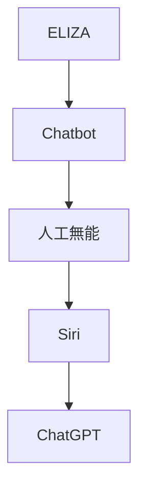
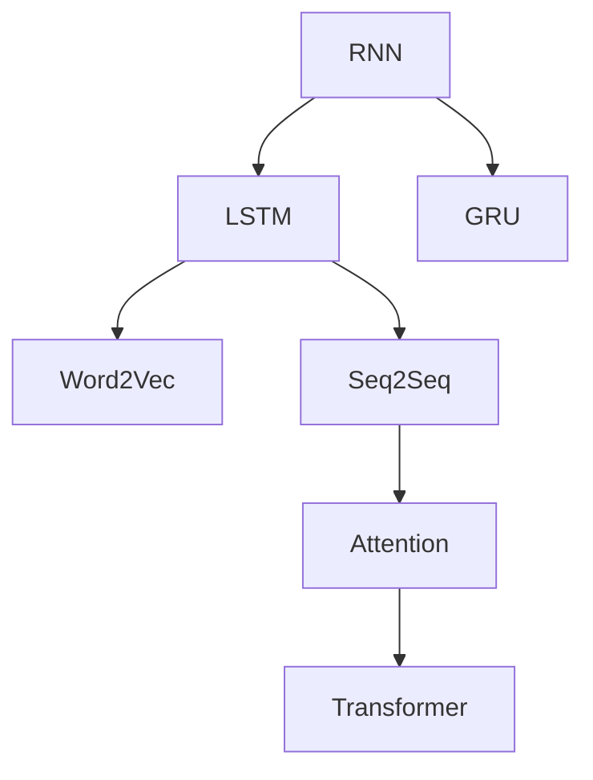
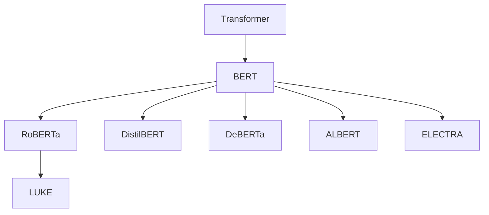
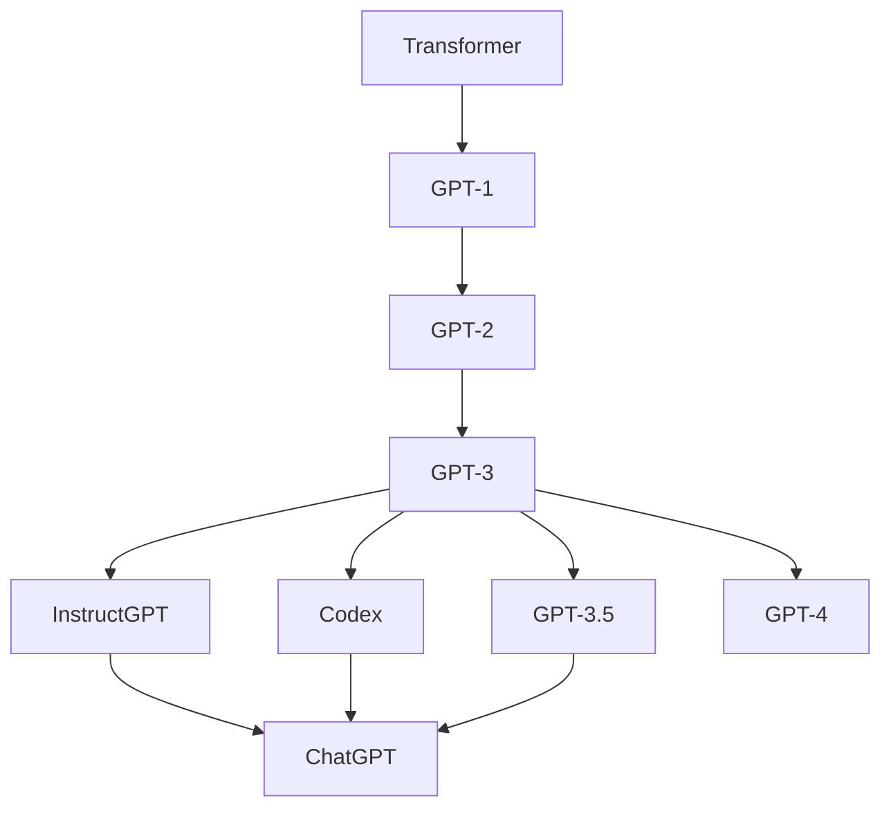
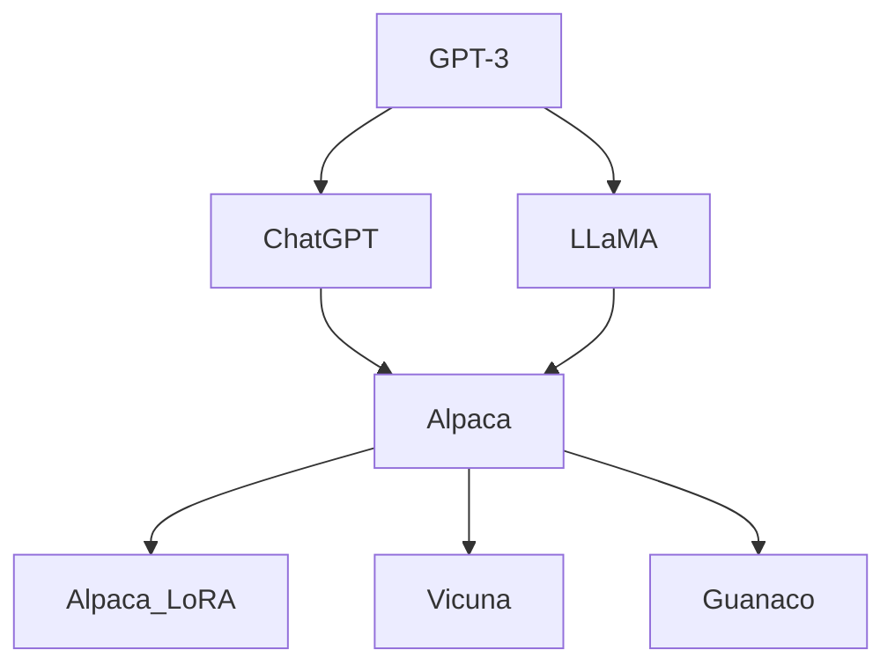
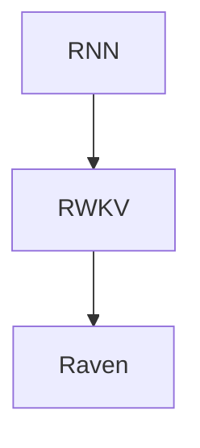
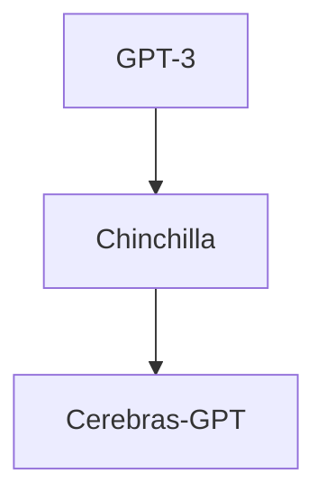

# LLMs

## The History of Chatbots

*[ELIZA](https://en.wikipedia.org/wiki/ELIZA) (1966)*
初期の人工知能プログラムのひとつ。
ルールベースの簡単なパターンマッチングで返答していた。
ELIZA(DOCTOR)は心理療法士の会話を模したものが有名。

*[PARRY](https://ja.wikipedia.org/wiki/PARRY) (1972)*
PARRYは偏執病的統合失調症患者をシミュレートしようとしたもの。
ELIZA(DOCTOR)と通信し話題となった。

*[A.L.I.C.E](https://ja.wikipedia.org/wiki/Artificial_Linguistic_Internet_Computer_Entity) (1995)*
ヒューリスティックパターンマッチングを使用している。
パターンマッチング手法の集大成といえる。

*[Jabberwacky](https://ja.wikipedia.org/wiki/Jabberwacky) (1997)*
ユーモラスな人間同士の自然な会話をシミュレートすることを目的としていた。
ユーザーとの会話の大規模なデータベースを構築し、言語と文脈を学習することができた。

*[人工無能](https://ja.wikipedia.org/wiki/%E4%BA%BA%E5%B7%A5%E7%84%A1%E8%84%B3) (1995)*
一方日本では、ゆいぼっとや人工無能うずらが流行っていた。
日本語は分かち書きされておらず、[形態素解析](https://ja.wikipedia.org/wiki/%E5%BD%A2%E6%85%8B%E7%B4%A0%E8%A7%A3%E6%9E%90)などの前処理が必要だった。

代表的な形態素解析ソフトウェアは以下の通り。
[JUMAN](https://ja.wikipedia.org/wiki/JUMAN) (1987)
[ChaSen 茶筌](https://ja.wikipedia.org/wiki/ChaSen) (1995)
[MeCab 和布蕪](https://ja.wikipedia.org/wiki/MeCab) (2005)
JUMAN++ (2015)

*[デスクトップ マスコット](https://ja.wikipedia.org/wiki/%E4%BC%BA%E3%81%8B) (1998)*
その後、ペルソナウェア、偽ペルソナウェア、伺か、が流行っていた。

*[Siri](https://ja.wikipedia.org/wiki/Siri) (2011)*
Hey, Siri!
iPhoneに搭載され話題となった。

*[Alexa](https://ja.wikipedia.org/wiki/Amazon_Alexa) (2014)*
Amazon Echoに搭載され話題となった。
スキルと呼ばれるサードパーティ製のアプリを活用することができる。
同時期にWindowsのCortanaなどがある。

*[りんな](https://ja.wikipedia.org/wiki/%E3%82%8A%E3%82%93%E3%81%AA_(%E4%BA%BA%E5%B7%A5%E7%9F%A5%E8%83%BD)) (2015)*
LINEに登場して話題となった。

*[Googleアシスタント](https://ja.wikipedia.org/wiki/Google_%E3%82%A2%E3%82%B7%E3%82%B9%E3%82%BF%E3%83%B3%E3%83%88) (2017)*
OK, Google!
今までのGoogle Nowの仕組みと組み合わせて、音声でAndroidを操作することができる。

*[ChatGPT](https://ja.wikipedia.org/wiki/ChatGPT) (2022)*
OpenAIが開発した大規模言語モデルGPT-3を利用したシステム。
対話だけでなく、要約や翻訳などさまざまな自然言語処理を行うことができる。
Codexなどを組み込んだGPT-3.5が爆発的な人気を呼んだ。

## The History of LLMs

*[RNN](https://ja.wikipedia.org/wiki/%E5%9B%9E%E5%B8%B0%E5%9E%8B%E3%83%8B%E3%83%A5%E3%83%BC%E3%83%A9%E3%83%AB%E3%83%8D%E3%83%83%E3%83%88%E3%83%AF%E3%83%BC%E3%82%AF) (1986, 2012)*
RNNの考え自体は昔からあった。
中間層で再帰的な結合があり、時系列のデータを処理することができた。
しかし再帰的な処理は計算コストが高く、ハードウェアの性能が足りなかった。
また勾配消失があり学習が収束しない問題があった。
そのため、RNN以外の研究に移っていった。
その後、CNNでDeep Learningが注目を集め、RNNにも注目が戻ってきた。

*[LSTM](https://ja.wikipedia.org/wiki/%E9%95%B7%E3%83%BB%E7%9F%AD%E6%9C%9F%E8%A8%98%E6%86%B6) (1997, 2007)*
RNNの勾配消失を解決するためにLSTMが登場した。
長期的な記憶を保持することができるようになった。

*[GRU](https://ja.wikipedia.org/wiki/%E3%82%B2%E3%83%BC%E3%83%88%E4%BB%98%E3%81%8D%E5%9B%9E%E5%B8%B0%E5%9E%8B%E3%83%A6%E3%83%8B%E3%83%83%E3%83%88) (2014)*
LSTMよりも簡単な構造を持ち、パラメータ数が少なく、計算コストが低い。
いくつかの問題ではLSTMに類似する性能が発揮された。
しかし、LSTMの優位性を上回ることができなかった。

*[Word2vec](https://ja.wikipedia.org/wiki/Word2vec) (2013)*
Word2vecというワードをベクトル化して計算できる手法が登場した。

*[Seq2Seq](https://en.wikipedia.org/wiki/Seq2seq) (2014)*
EncoderとDecoderを搭載したSeq2Seqという手法が登場した。
Seq2Seqは、翻訳や対話システム、要約などの様々な自然言語処理のタスクで、高い精度を達成することができた。

*[Attention](https://ja.wikipedia.org/wiki/%E3%82%A2%E3%83%86%E3%83%B3%E3%82%B7%E3%83%A7%E3%83%B3_(%E6%A9%9F%E6%A2%B0%E5%AD%A6%E7%BF%92)) (2014)*
ニューラル機械翻訳において、従来のSeq2SeqにAttentionメカニズムを導入することで、翻訳の品質を向上させることができた。

*[Transformer](https://ja.wikipedia.org/wiki/Transformer_(%E6%A9%9F%E6%A2%B0%E5%AD%A6%E7%BF%92%E3%83%A2%E3%83%87%E3%83%AB)) (2017.06.12)*
RNNやLSTMは再帰的に処理を行うため、長い文脈だと計算コストが増大する問題があった。
Self-Attentionを用いることで、効率的に処理できるようになった。

*[BERT](https://ja.wikipedia.org/wiki/BERT_(%E8%A8%80%E8%AA%9E%E3%83%A2%E3%83%87%E3%83%AB)) (2018.10.11 Google)*
Decoderを無くしたのはGPT-1と同じだが、双方向(Bidirectional)なAttention層が追加されている。
Transformerが12層連なっているためモデルが大きい。

*[RoBERTa](https://ai.facebook.com/blog/roberta-an-optimized-method-for-pretraining-self-supervised-nlp-systems/) (2019.07.26 Facebook AI Research)*
Robustly optimized BERT approachの略。
BERTの仕組みをそのままに、パラメータの調整やデータ量を増大させたもの。

*LUKE (2020.04)*
RoBERTaベース。
日本人を中心としたチームが開発したモデル。
entity-aware self-attention。

*[DistilBERT](https://github.com/BandaiNamcoResearchInc/DistilBERT-base-jp/blob/main/docs/GUIDE.md) (2019.12.08 Huggingface)*
Distilated-BERTの略。
BERTを蒸留したもの。
BERTに比べ、軽量で高速になった。

*[DeBERTa](https://github.com/microsoft/DeBERTa) (2020.06.13 Microsoft Research)*
Decoding-enhanced BERT with Disentangled Attentionの略。
SuperGLUEのベンチマークで人間の基準を上回るスコアを記録し話題となった。
V2: 2021.02.03
V3: 2021.11.16

*[ALBERT](https://medium.com/syncedreview/googles-albert-is-a-leaner-bert-achieves-sota-on-3-nlp-benchmarks-f64466dd583) (2020 Google)*
A Lite BERTの略。
BERTの軽量版。

*ELECTRA*
RoBERTaと同様にBERTの事前学習を改良したもの。

*GPT-1 (2018.06.11 OpenAI)*
TransformerのEncoder部分のみを用いて、大規模テキストデータで学習したものがGPTとなる。
GPT(Generative Pretrained Transformer)の名前が示す通り、事前学習や転移学習で特定のタスクに適応させている。

GPTの初期モデル。
BookCorpus 7000冊のデータ4.5GB を事前学習に用いた。
1.2億個のパラメータ。

*GPT-2 (2019.02.14 OpenAI)*
GPTの仕組みは大規模化が可能だった。
そのため、データセットとパラメータ数を増やす方向にシフトしていった。

WEBから収集した40GBのデータ。
15億パラメータ。

*GPT-3 (2020.06.11 OpenAI)*
大規模化でGPT-3を超えたあたりでとても優秀になった。

WEBから収集した570GBのデータ。
1750億個パラメータ。

*InstructGPT*

*Codex*

*GPT-3.5 (2022.03.15 OpenAI)*
text-davinci-003

3550億個パラメータ。

*ChatGPT (2022.11)*

*GPT-4 (2023.03.14 OpenAI)*

*Seq2Seq (2014)*
algo: Encoder + Decorder
Encoder is "Text to Vector"
RNN or LSTM

*Transformer (2017)*
algo: Attention

*GPT-1 (2018)*

GPT-Neo
GPT-J
GPT-NeoX

GLaM
LaMDA
PaLM
Alpaka
Chinchilla
OPT
BLOOM
LLaMA
Cerebras-GPT
Falcon
StableLM

