# LLMs

## The History of Chatbots

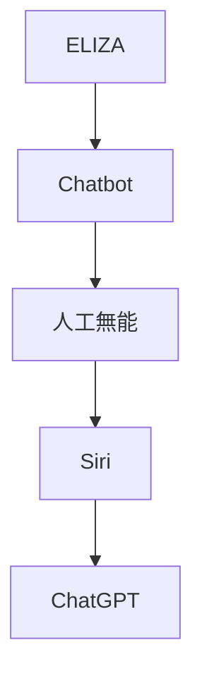

*[ELIZA](https://en.wikipedia.org/wiki/ELIZA) (1966)*
初期の人工知能プログラムのひとつ。
ルールベースの簡単なパターンマッチングで返答していた。
ELIZA(DOCTOR)は心理療法士の会話を模したものが有名。

*[PARRY](https://ja.wikipedia.org/wiki/PARRY) (1972)*
PARRYは偏執病的統合失調症患者をシミュレートしようとしたもの。
ELIZA(DOCTOR)と通信し話題となった。

*[A.L.I.C.E](https://ja.wikipedia.org/wiki/Artificial_Linguistic_Internet_Computer_Entity) (1995)*
ヒューリスティックパターンマッチングを使用している。
パターンマッチング手法の集大成といえる。

*[Jabberwacky](https://ja.wikipedia.org/wiki/Jabberwacky) (1997)*
ユーモラスな人間同士の自然な会話をシミュレートすることを目的としていた。
ユーザーとの会話の大規模なデータベースを構築し、言語と文脈を学習することができた。

*[人工無能](https://ja.wikipedia.org/wiki/%E4%BA%BA%E5%B7%A5%E7%84%A1%E8%84%B3) (1995)*
一方日本では、ゆいぼっとや人工無能うずらが流行っていた。
日本語は分かち書きされておらず、[形態素解析](https://ja.wikipedia.org/wiki/%E5%BD%A2%E6%85%8B%E7%B4%A0%E8%A7%A3%E6%9E%90)などの前処理が必要だった。

代表的な形態素解析ソフトウェアは以下の通り。
[JUMAN](https://ja.wikipedia.org/wiki/JUMAN) (1987)
[ChaSen 茶筌](https://ja.wikipedia.org/wiki/ChaSen) (1995)
[MeCab 和布蕪](https://ja.wikipedia.org/wiki/MeCab) (2005)
JUMAN++ (2015)

*[デスクトップ マスコット](https://ja.wikipedia.org/wiki/%E4%BC%BA%E3%81%8B) (1998)*
その後、ペルソナウェア、偽ペルソナウェア、伺か、が流行っていた。

*[IBM Watson](https://en.wikipedia.org/wiki/IBM_Watson) (2011)*
クイズ番組に出場させるために開発された。

*[Siri](https://ja.wikipedia.org/wiki/Siri) (2011)*
Hey, Siri!
iPhoneに搭載され話題となった。

*[Mitsuku](https://en.wikipedia.org/wiki/Kuki_AI) (2013)*
2013年から2019年の間にローブナー賞で5回優勝している。
2021年にはKuki AIという名前に代わり、メタバースに進出した。

*[Alexa](https://ja.wikipedia.org/wiki/Amazon_Alexa) (2014)*
Amazon Echoに搭載され話題となった。
スキルと呼ばれるサードパーティ製のアプリを活用することができる。
同時期にWindowsのCortanaなどがある。

*[りんな](https://ja.wikipedia.org/wiki/%E3%82%8A%E3%82%93%E3%81%AA_(%E4%BA%BA%E5%B7%A5%E7%9F%A5%E8%83%BD)) (2015)*
LINEに登場して話題となった。

*[Googleアシスタント](https://ja.wikipedia.org/wiki/Google_%E3%82%A2%E3%82%B7%E3%82%B9%E3%82%BF%E3%83%B3%E3%83%88) (2017)*
OK, Google!
今までのGoogle Nowの仕組みと組み合わせて、音声でAndroidを操作することができる。

*[Meena](https://ja.wikipedia.org/wiki/LaMDA) (2020)*
Meenaとして開発されたものが、のちにLaMDAとなった。

*[ChatGPT](https://ja.wikipedia.org/wiki/ChatGPT) (2022)*
OpenAIが開発した大規模言語モデルGPT-3を利用したシステム。
対話だけでなく、要約や翻訳などさまざまな自然言語処理を行うことができる。
Codexなどを組み込んだGPT-3.5が爆発的な人気を呼んだ。

## The History of LLMs

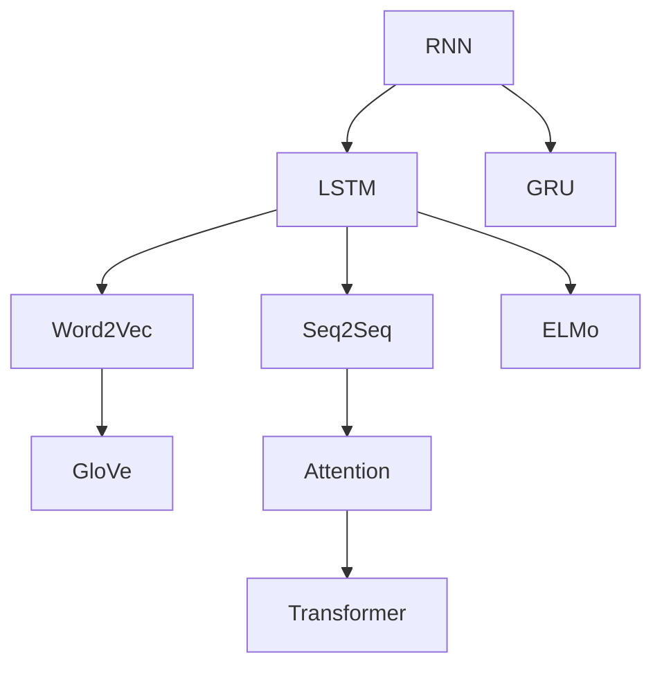

*[RNN](https://ja.wikipedia.org/wiki/%E5%9B%9E%E5%B8%B0%E5%9E%8B%E3%83%8B%E3%83%A5%E3%83%BC%E3%83%A9%E3%83%AB%E3%83%8D%E3%83%83%E3%83%88%E3%83%AF%E3%83%BC%E3%82%AF) (1986, 2012)*
RNNの考え自体は昔からあった。
中間層で再帰的な結合があり、時系列のデータを処理することができた。
しかし再帰的な処理は計算コストが高く、ハードウェアの性能が足りなかった。
また勾配消失があり学習が収束しない問題があった。
そのため、RNN以外の研究に移っていった。
その後、CNNでDeep Learningが注目を集め、RNNにも注目が戻ってきた。

*[LSTM](https://ja.wikipedia.org/wiki/%E9%95%B7%E3%83%BB%E7%9F%AD%E6%9C%9F%E8%A8%98%E6%86%B6) (1997, 2007)*
RNNの勾配消失を解決するためにLSTMが登場した。
長期的な記憶を保持することができるようになった。

*[GRU](https://ja.wikipedia.org/wiki/%E3%82%B2%E3%83%BC%E3%83%88%E4%BB%98%E3%81%8D%E5%9B%9E%E5%B8%B0%E5%9E%8B%E3%83%A6%E3%83%8B%E3%83%83%E3%83%88) (2014)*
LSTMよりも簡単な構造を持ち、パラメータ数が少なく、計算コストが低い。
いくつかの問題ではLSTMに類似する性能が発揮された。
しかし、LSTMの優位性を上回ることができなかった。

*[Word2Vec](https://ja.wikipedia.org/wiki/Word2vec) (2013)*
Word2Vecというワードをベクトル化して計算できる手法が登場した。

*[GloVe](https://en.wikipedia.org/wiki/GloVe) (2014)*
Word2Vecの局所的(local)な表現と、大局的(Gloval)な表現を組み合わせた手法。

*[Seq2Seq](https://en.wikipedia.org/wiki/Seq2seq) (2014)*
EncoderとDecoderを搭載したSeq2Seqという手法が登場した。
Seq2Seqは、翻訳や対話システム、要約などの様々な自然言語処理のタスクで、高い精度を達成することができた。

*[Attention](https://ja.wikipedia.org/wiki/%E3%82%A2%E3%83%86%E3%83%B3%E3%82%B7%E3%83%A7%E3%83%B3_(%E6%A9%9F%E6%A2%B0%E5%AD%A6%E7%BF%92)) (2014)*
ニューラル機械翻訳において、従来のSeq2SeqにAttentionメカニズムを導入することで、翻訳の品質を向上させることができた。

*[Transformer](https://ja.wikipedia.org/wiki/Transformer_(%E6%A9%9F%E6%A2%B0%E5%AD%A6%E7%BF%92%E3%83%A2%E3%83%87%E3%83%AB)) (2017.06.12)*
RNNやLSTMは再帰的に処理を行うため、長い文脈だと計算コストが増大する問題があった。
Self-Attentionを用いることで、効率的に処理できるようになった。

*[ELMo](https://en.wikipedia.org/wiki/ELMo) (2018.02.15 AllenAI)*
Word2VecやGloVeでは単語のみのベクトル化だったので、文脈を考慮できるようにしたもの。
2層のLSTMを2つ使った、双方向LSTM。

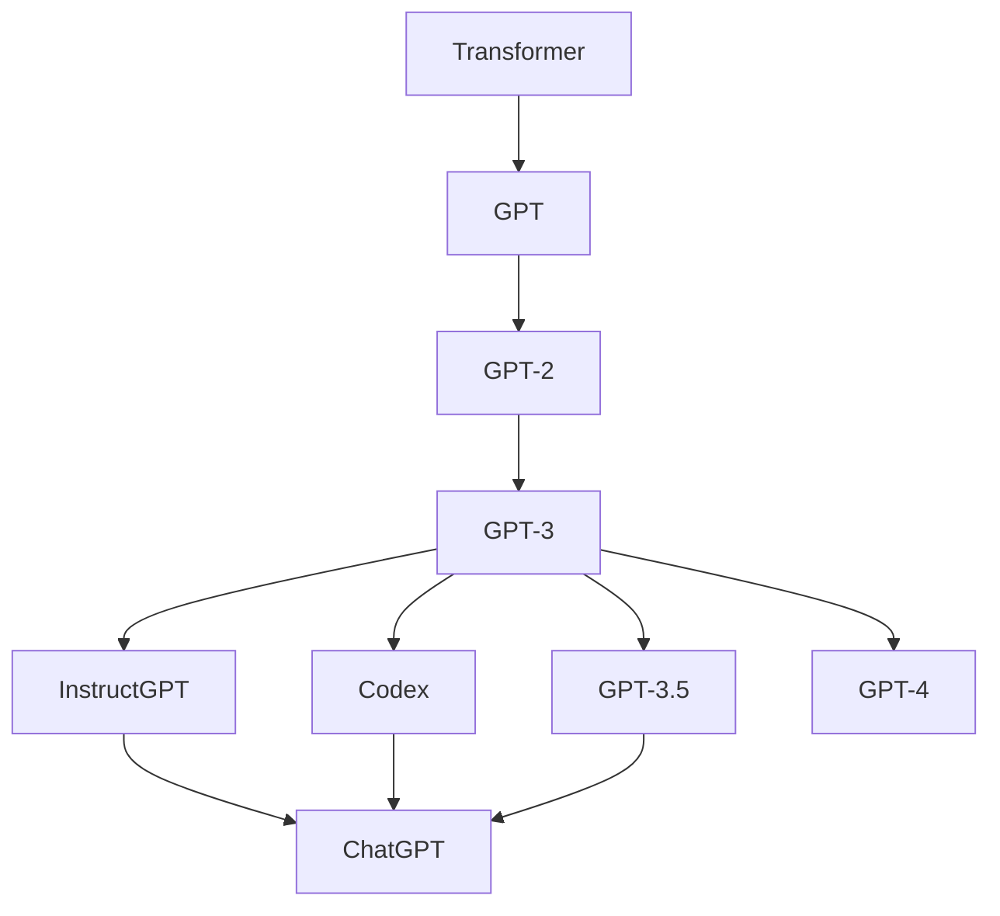

*[GPT](https://ja.wikipedia.org/wiki/GPT_(%E8%A8%80%E8%AA%9E%E3%83%A2%E3%83%87%E3%83%AB)) (2018.06.11 OpenAI)*
TransformerのDecoderを用いて、大規模テキストデータで学習したものがGPTとなる。
Transformerが12層連なっているためモデルが大きい。

ELMoのLSTMが特徴抽出が十分でなかったため、Transformerを使用する手法が考えられた。
しかし、双方向ではなくなり、後のBERTの登場につながった。
一方向から推測するので、BERTよりテキスト生成タスクに向いている。

GPTの初期モデル。
BookCorpus 7000冊のデータ4.5GB を事前学習に用いた。
1.2億個のパラメータ。

*[GPT-2](https://ja.wikipedia.org/wiki/GPT-2) (2019.02.14 OpenAI)*
人間が読んでも違和感が少ない一貫した内容の文章を生成できるようになった。

WEBから収集した40GBのデータ。
15億パラメータ。

*[GPT-3](https://ja.wikipedia.org/wiki/GPT-3) (2020.05.28 OpenAI)*
GPT-3を超えたあたりでとても優秀になった。
OpenAIはGPT-3はClosed-Sourceとした。

OpenAIはTransformerの仕組みはスケーリング則に則り、大規模化が可能との論文を発表した。
パラメータ数N、データセットサイズD、計算予算Cの3つの変数のべき乗則に従う。

WEBから収集した570GBのデータ。
1750億個パラメータ。

*InstructGPT*
GPT-3の小型版を使用して、RLHFを取り入れたモデル。
RLHF(Reinforcement Learning from Human Feedback)は、
人間からのフィードバックでファインチューニングする手法。

*[OpenAI Codex](https://ja.wikipedia.org/wiki/OpenAI_Codex) (2021.08 OpenAI)*
自然言語からコードを生成するためのモデル。
GitHub Copilotで使われている。

120億個パラメータ。

Microsoft CodeBERT
NovelAI Genji(GPT-Jベース)

*GPT-3.5 (2022.03.15 OpenAI)*
初期バージョン
text-davinci-002
code-davinci-002

*GPT-3.5v2 (2022.11.28 OpenAI)*
改良バージョン
gpt-3.5-turbo 会話用
text-davinci-003

3550億個パラメータ。

*[ChatGPT](https://ja.wikipedia.org/wiki/ChatGPT) (2022.11.30 OpenAI)*
InstructGPTの兄弟モデル。
チャット向けに調整されている。

*[GPT-4](https://ja.wikipedia.org/wiki/GPT-4) (2023.03.14 OpenAI)*
マルチモーダル。

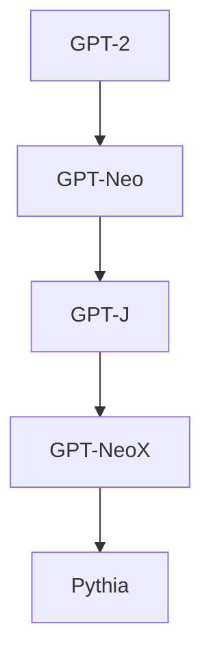

*GPT-Neo (2021.03 EleutherAI)*
GPT-3がClosed-Sourceだったので、Open-SourceのGPT-3を作成することを目的としたモデル。
GPT-3以降Closed-Sourceのものが増えた。

*[GPT-J](https://en.wikipedia.org/wiki/GPT-J) (2021.05 EleutherAI)*
60億パラメータ。

*GPT-NeoX (2022.04 EleutherAI)*
GPT-3に匹敵する。
200億パラメータ。
Microsoft DeepSpeedを使って学習を高速化している。
Nvidia Megatronを使って分散して学習した。

*Pythia*

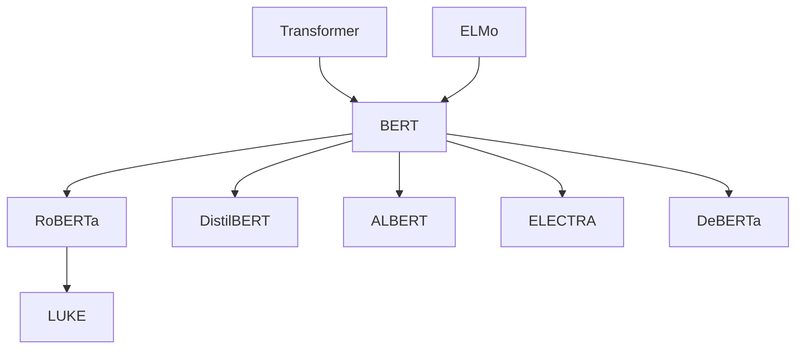

*[BERT](https://ja.wikipedia.org/wiki/BERT_(%E8%A8%80%E8%AA%9E%E3%83%A2%E3%83%87%E3%83%AB)) (2018.10.11 Google)*
Pretraining Architecture: Encoder
Bidirectional Encoder Representations from Transformersの略。
GPTとは違い、TransformerのEncoderを使用し、文章の先頭と末尾からの双方向(Bidirectional)なAttention層が追加されている。
MLM(Masked Language Modeling)という手法を用いて、ラベリングなしの少ないデータから学習できた。
また文脈を予測するためにNSP(Next Sentence Prediction)という手法が用いられた。

GPT-1を超えて最高スコアを更新し、応用も効くため話題となった。
その後GPT-3が発表されるまでBERT系が多く登場することとなった。

*[RoBERTa](https://ai.facebook.com/blog/roberta-an-optimized-method-for-pretraining-self-supervised-nlp-systems/) (2019.07.26 Facebook AI Research)*
Robustly optimized BERT approachの略。
BERTの仕組みをそのままに、パラメータの調整やデータ量を増大させたもの。

*DistilBERT (2019.08.02 Huggingface)*
BERTを蒸留したもの。

*[ALBERT](https://medium.com/syncedreview/googles-albert-is-a-leaner-bert-achieves-sota-on-3-nlp-benchmarks-f64466dd583) (2019.09.20 Google)*
Pretraining Task: MLM/NSP
Num. Params: Base = 12M, Large = 18M, XLarge = 60M
A Lite BERTの略。
パラメータの因数分解と冗長性を排除することで、軽量化したモデル。

BERT-baseモデルを軽量化すると、12MパラメータのALBERT-baseモデルが作成できた。
これは89%の削減となるが、性能の低下はわずかだった。
モデルサイズが縮小されたので、より大規模な構成を行えるようになった。
ALBERT-xxlarge構成では最新のスコアを更新した。

*[ELECTRA](https://arxiv.org/abs/2003.10555) (20219.09.26 Stanford, Google)*
GANの手法を取り入れて、BERTの事前学習手法を改良した。
MLMは文章中のマスクした15%を学習できない問題点があった。
ELECTRAではReplaced Token Detectionという手法を用いて、より少ないデータで効率的な事前学習ができる。
RoBERTaの1/4の学習量で同等の精度を達成した。

*[LUKE](https://arxiv.org/abs/2010.01057) (2020.04)*
RoBERTaベース。
entity-aware self-attentionという仕組みを導入した。
日本人を中心としたチームが開発したモデル。
5つのタスクでスコアを更新し話題となった。
その後も日本語の最高スコアを維持し続けていた。

*[DeBERTa](https://github.com/microsoft/DeBERTa) (2020.06.13 Microsoft)*
Decoding-enhanced BERT with Disentangled Attentionの略。
SuperGLUEのベンチマークで人間の基準を上回るスコアを記録し話題となった。

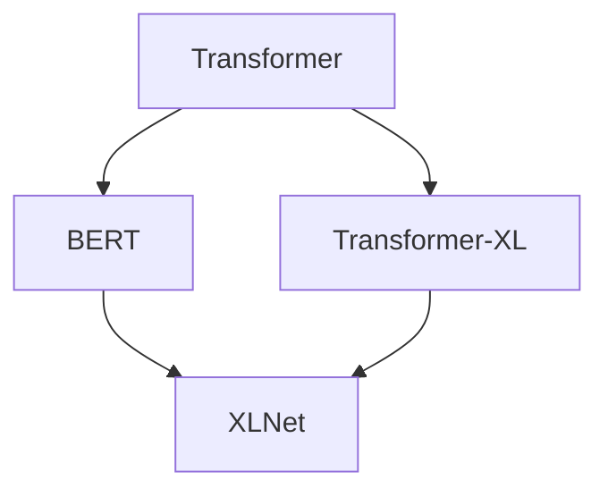

*[Transformer-XL](https://arxiv.org/abs/1901.02860) (2019.01.09)*
Transformer Extra Largeの略。
Transformerではdot-product attentionの性質上、固定長パラメータしか扱えなかった。
そしてパラメータの全ての組み合わせを考慮するため、二乗の計算量が必要となり、長大なパラメータを持たせることは現実的ではなかった。
Transformer-XLではセグメントに分けて、長文に対応できるようにした。
またRelative Positional Encodingsという手法で単語の位置情報も学習に取り入れた。

*[XLNet](https://arxiv.org/abs/1906.08237) (2019.06.19 Google)*
BERTの改良版。
20のタスクでBERTを超えたと話題になった。
しかし計算量も増大した。

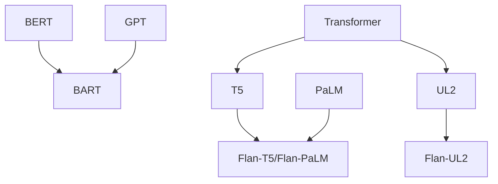

*[BART](https://arxiv.org/abs/1910.13461) (2019.10.29 Meta)*
Bidirectional Auto-Regressive Transformerの略です。
BERTのEncoderとGPTのDecoderを組み合わせたもの。

*[T5](https://arxiv.org/abs/1910.10683) (2019.10.23 Google)*
Text-to-Text Transfer Transformerで、Tが5つあるのでT5と略される。
T5はオリジナルのTransformerと同様にEncoderとDecorderの両方を使用している。

多数のLLMが開発され、評価が困難になってきた。
何が最も転移学習を有効にしているのか？を調査した結果、誕生したのがT5となる。

Colossal Clean Crawled Corpus(C4)を作成して、学習に利用している。

110億のパラメタ。
C4データセットを使用。
GPT-2レベル。

*Flan-T5/Flan-PaLM (2022.10.20 Google)*
指示調整タスクのFlan Collectionを使って学習したT5モデル。
GPT-3レベルのオープンソース言語モデル。

*[UL2](https://ai.googleblog.com/2022/10/ul2-20b-open-source-unified-language.html)* (2020.10.14 Google)
Unified Language Learnerの略。
データセットやセットアップによらずに言語モデルの性能を上げる手法。
2種類の言語モデルの長所を併せ持つ。

20B

*Flan-UL2*
指示調整タスクのFlan Collectionを使って学習したUL2モデル。
商用利用可能。
GoogleがLLaMAに対抗するようにオープンソースで公開した。

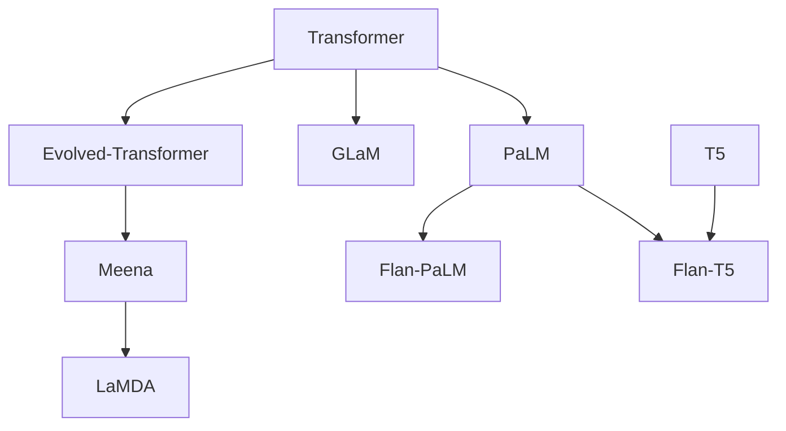

*Meena (2020.01.28 Google)*
Googleが開発したチャットボット。
１つのEvolved Transformer Encoderと13のDecoderからなる。
LaMDAの前身。

26億のパラメータをもつ。
パブリックドメインのソーシャルメディアの会話から341GBのテキストでトレーニングされている。

*[LaMDA](https://ja.wikipedia.org/wiki/LaMDA) (2021.05, 2022.01.21 Google)*
Language Model for Dialogue Applicationsの略。
もともとはMeenaとして開発されたが、のちにLaMDAとして発表された。
Googleの社員が意識が宿ったと述べて話題となった。

1370億のパラメータを持つ。
1.56T words。

*GLaM (2021.12.09 Google)*
Generalist Language Modelの略。
1.2兆のパラメータを持つ重量級モデル。
ただし、特定の入力に特化したExpertをサブモデルに持っている。
そのため推論時には、2つのExpert層のみ、970億(1.2Tの8%)のサブネットワークのみが活性化される。
この2つだけ活性化させるスパース性を利用して効率的に学習、実行できるようにした。
活性化時のパラメータはGPT-3より少ないが、GPT-3と遜色ない性能を発揮することができた。

*PaLM (2022.04.04 Google)*
Pathways Language Modelの略。
1つのモデルで何でもできる汎用(Pathways)をめざしたモデル。
GPTと同じDecoderタイプのTransformerを採用している。

規模が大きくなるにつれて、機能が解放されていくイメージ。
OpenAIのスケーリング則を追検証した形となる。
Gopherなどの先行LLMではモデル規模を拡大しても性能向上の恩恵はあまり見られなかった。

5400億のパラメータ。

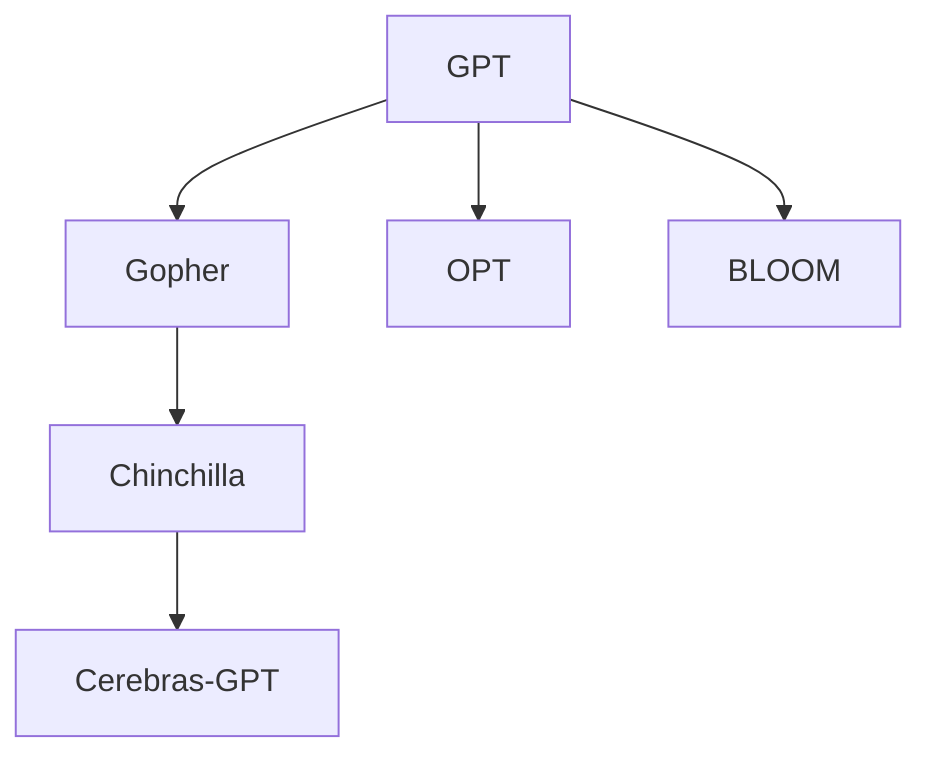

*[Gopher](https://arxiv.org/abs/2112.11446) (2021.12.08 DeepMind)*
2800億のパラメータを持つ。
Massive Textと呼ばれる10.5TBの英語テキストデータを作成し、学習に用いた。
124種中100種のタスクで最高記録を更新して話題となった。

*[Chinchilla](https://en.wikipedia.org/wiki/Chinchilla_AI) (2022.03.29 DeepMind)*
700億のパラメータを持つ。
言語モデルのパラメータとサイズ、トレーニングに使用されるデータ量を見直すことで、GPT-3やGopherの性能を上回った。

SparrowはChinchillaのプロンプトバージョンです。

*Cerebras-GPT (2023.03.28 Cerebras)*
chinchillaのスケーリング則を参考。
111M, 256m, 590M, 1.3B, 2.7B, 6.7B, 13Bのモデルがある。
オープンなデータセットを使用。
オープンソース。

*OPT (2022.05.02 Meta)*
1750億のパラメータを持つ。

*BLOOM (2022.07 BigScience)*
BigScience Large Open-Science Open-Access Multilingual Language Modelの略。
70以上の国と250以上の機関の1000人を超える研究者の協力で作成された多言語LLM。
46の自然言語と13のプログラミング言語を扱える。
初のオープンソースLLMとなる？？？

学習にはNVIDIA A100が384枚で4か月かかったとされる。
コストは200万ドル～500万ドルと推定される。

GPT-3と同様のパラメータを持つ軽量化モデルでも329GBあるので、動かすだけでも24GBのGPUが14枚以上必要とされる。
1Bのモデルだと12GBのGPUで動かすことができる。

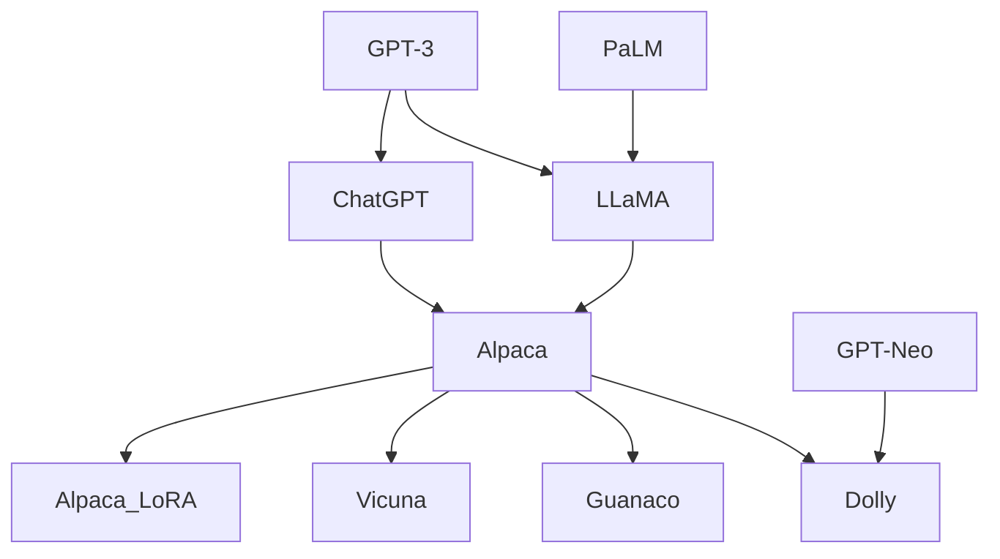

LLaMA (2023.02.24 Meta)
商用利用禁止、研究目的にのみ使用可能。

65Bと33Bは1.4兆トークンでトレーニングされている。
7Bは1兆個のトークン。

65B

LLaMA-13BはGPT-3(175B)よりほとんどのベンチマークで優れている。

Alpaca (2023.03 Stanford)
LLaMA 7BモデルをChatGPTとの1.3万回の会話データで微調整したもの。
A100 8枚で3hかかった。
もとになったMLLaMAが研究目的限定で、さらにOpenAIの利用規定で、GPTの出力をもとに、GPTに対抗できるAIを作ってはいけない制約があるので、研究目的以外に使用することはできない。

Vicuna
AlpacaをShareGPTのデータで微調整したもの。

Dolly-v2
Databricksは自社の社員による1.5万回の会話データセットを作り、Dolly-v2として公開した。

StableLM
StableDiffusionによる、クリーンかつ自由なモデル。

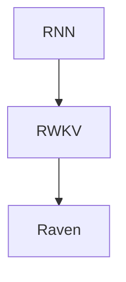

Falcon

Archi: Pretraining Architecture
Task: Pretraining Task

M=million=100万
B=billion=10億
T=trillion=1兆

<!-- 
 -->

|Date|Lab|Name|Family|Archi|Task|Params|Corpus|Cost|License|Note|
|--|--|--|--|--|--|--|--|--|--|--|
|2018.06.11|OpenAI|GPT|Transformer|Decoder|LM|117M|BookCorpus 4.5GB|8GPUs 1month, 1.7e19 FLOP||
|2019.02.14|OpenAI|GPT-2|GPT|Decoder|LM|1.5B|40GB webtext, 10B tokens|1.5e21 FLOP|MIT|
|2020.05.28|OpenAI|GPT-3|GPT|Decoder|LM|175B|570GB plaintext, 499B tokens|3.1e23 FLOP|API||
|2022.03.15|OpenAI|GPT-3.5|GPT|Decoder|LM, RLHF|175B|Same as InstructGPT||API||
|2022.11.30|OpenAI|ChatGPT|GPT|Decoder|LM, RLHF|175B|Same as GPT3 + datasets generated for RLHF||API||
|2023.03.14|OpenAI|GPT-4|GPT|Decoder|LM, RLHF|-|-|Estimated 2.1e25 FLOP|API||
|2021.03|EleutherAI|GPT-Neo|GPT-2|Decoder|LM|125M, 350M, 1.3B, 2.7B (XL)|Pile||MIT||
|2021.05|EleutherAI|GPT-J|GPT-2|Decoder|LM|6B|Pile||Apache2.0|||
|2022.04|EleutherAI|GPT-NeoX|GPT-3|Decoder|LM|20B|Pile||Apache2.0||
|★Date|Lab|Name|Family|Archi|Task|Params|Corpus|Cost|License|Note|
|2018.02.15|UW, AllenAI|ELMo|-|LSTM|-|94M||||||
|2018.10.11|Google|BERT|Transformer|Encoder|MLM/NSP|Base = 110M, Large = 340M|3.3B words: Toronto Book Corpus and Wikipedia||Apache2.0||
|2019.07.26|UW, Google|RoBERTa|BERT|Encoder|MLM(Dynamic)|Base = 125M, Large = 356M|Same as BERT + CC News + OpenWebText + Stories(33B words)||||
|2019.08.02|Huggingface|DistilBERT|BERT|Encoder|MLM/NSP|66M|Same as BERT||||
|2019.09.20|Google|ALBERT|BERT|Encoder|MLM/NSP|Base = 12M, Large = 18M, XLarge = 60M|Same as BERT||||
|2019.09.26|Stanford, Google|ELECTRA|BERT|Encoder|RTD|Small = 14M, Base = 110M, Large = 330M|Same as BERT except for Large with is same as XLNet||||
|2020.06.13|Microsoft|DeBERTa|BERT|Encoder|MLM|750M (xlarge)|English Wikipedia, BookCorpus, OPENWEBTEXT and STORIES||MIT||
|★Date|Lab|Name|Family|Archi|Task|Params|Corpus|Cost|License|Note|
|2019.06.19|CMU, Google|XLNet|Transformer XL|Decoder|PLM|Base=117M, Large=360M|33B words: Same as BERT + Giga5 (16GB text) + and aggressively filtered ClueWeb 2012-B (19GB), Common Crawl (110 GB)||Apache2.0|||
|2019.10.29|Facebook|BART|BERT for encoder, GPT for Decoder|Encoder/Decoder|DAE|10% more than BERT|Same as RoBERTa|||||
|2019.10.23|Google|T5|Transformer|Encoder/Decoder|DAE|60M, 220M, 770M, 3B, 11B|C4(750GB)||||
|2021.01|Google|Switch|T5|Encoder/Decoder, MoE|DAE|1T|C4||||
|2022.10.20|Google|Flan-T5|T5|Encoder/Decoder|Instruction Tuning|80M, 250M, 780M, 3B, 11B|Flan Collection||Apache-2.0||
|2022.10.14|Google|UL2|Transformer|Encoder/Decoder|Mixture-of-Denoisers|20B|4C||Apache2.0||
|★Date|Lab|Name|Family|Archi|Task|Params|Corpus|Cost|License|Note|
|2021.12.09|Google|GLaM|Transformer|Decoder, MoE|LM|1.2T across 64 experts, but only 96B get activated for inference|1.6T tokens including web pages filtered by Wikipedia and books for quality||||
|2022.01.21|Google|LaMDA|Transformer|Decoder|LM|137B|1.56T words, 168B tokens||||
|2022.04.04|Google|PaLM|GPT|Decoder|LM|8B, 62B, 540B|780B tokens||||
|2022.10.22|Google|Flan-PaLM|PaLM|Decoder|Instruction Tuning|8B, 62B, 540B|same as PaLM + Flan Collection||||
|★Date|Lab|Name|Family|Archi|Task|Params|Corpus|Cost|License|Note|
|2021.12.08|DeepMind|Gopher|GPT|Decoder|LM|280B|MassiveText 10.5TB, 300B tokens||||
|2022.03.16|DeepMind|GopherCite|Gopher|Decoder|LM|280B|MassiveText 10.5TB, 300B tokens||||
|2022.03.29|DeepMind|Chinchilla|Gopher|Decoder|LM|70B|1.4T tokens, Massive Text||||
|2022.05.02|Facebook|OPT|GPT-3|Decoder|LM|175B|180B tokens = RoBERTa + the Pile + PushShift.io Reddit||||
|2022.07|BigScience|BLOOM|GPT|Decoder|LM|560m, 1.1B, 1.7B, 3B, 7.1B, 176B|366B tokens (1.5 TB of text data) multilingual dataset||||
|★Date|Lab|Name|Family|Archi|Task|Params|Corpus|Cost|License|Note|
|2023.02.24|Meta|LLaMA|PaLM？？？, GPT|Decoder|LM|6.7B, 13.0B, 32.5B, 65.2B|English CommonCrawl + C4 + Github + Wikipedia + Gutenberg and Books3 + ArXiv + Stack Exchange||学術用途のみ||
|2023.03|Stanford|Alpaca|LLaMA|Decoder|LM|7B, 13B？？？|Alpaca Dataset: 1.4T||学術用途のみ||
|2023.03|Stanford, UC Berkeley, CMU, UC San Diego, MBZUAI|Vicuna|LLaMA|Decoder|human instructions|13B|ShareGPT||学術用途のみ||
|★Date|Lab|Name|Family|Archi|Task|Params|Corpus|Cost|License|Note|

TODO: LUKE
TODO: Pythia
TODO: Cerebras
TODO: ？？？

TODO: データセット
TODO: HuggingFaceへのリンク、TensorHubへのリンク

<!-- 
 -->
<!-- 
|AlexaTM|2022.11|Amazon|20B|1.3T|API|||
|LLaMA|2023.02|Meta|13B-65B|LLaMA Dataset: 1.4T|学術用途のみ|||
|Vicuna||etc|7B-13B|ShareGPT会話データ|学術用途のみ|||
|Dolly-v2||Databricks|7B-13B|Databricks Dataset|オープン、商用可|||
|Cerebras-GPT|2023.03|Cerebras|13B||Apache2.0|||
|OpenAssistant|2023.03|LAION|17B|1.5T tokens|Apache2.0|||
|RWKV||BlinkDL|7B-13B|Pile|オープン、商用可|||
|Raven||BlinkDL|7B-13B|Alpaca Dataset|学術用途のみ|||
|StableLM||stability.ai|7B-13B|拡張Pile|オープン、商用可|||
-->

### 向いているタスク

BERTで使用されている、Encoderのみを使用する構造は、テキスト分類や固有表現抽出に向いている。
GPTで使用されている、Decoderのみを用いる構造は、文章生成に向いている。
T5で使用されている、Encoder、Decoderの構造は、翻訳や要約に向いている。

0-shotとは、追加学習なしの状態を示す。
few-shotは、わずかな追加学習をして、タスクに適応させたあとの状態を示す。

最先端(SOTA:State-Of-The-Art)

## Datasets

Pile
C4
MassiveText (DeepMind)
Wikipedia
GitHub

Flan Collection
指示調整タスク

思考連鎖プロンプト(CoT:Chain of Thought prompting)

## Others

Megatron

DeepSpeed

bitsandbytes

FlexGen

## 参考

[Wikipedia - LLM](https://en.wikipedia.org/wiki/Large_language_model)
[Transformer models: an introduction and catalog — 2023 Edition](https://amatriain.net/blog/transformer-models-an-introduction-and-catalog-2d1e9039f376/)
[A Catalog of Transformer Models](https://doi.org/10.48366/r585918)
[Multi-task Language Understanding on MMLU](https://paperswithcode.com/sota/multi-task-language-understanding-on-mmlu)
[LLMSurvey](https://github.com/rucaibox/llmsurvey)
[The Practical Guides for Large Language Models](https://github.com/mooler0410/llmspracticalguide)

[WebBigdata - 人工知能/機械学習 - モデル](https://webbigdata.jp/category/ai-ml/models/)
[百花繚乱の大規模言語モデル　その現状まとめ【2023年4月末版】](https://www.itmedia.co.jp/news/articles/2304/25/news156.html)
[大規模言語モデル間の性能比較まとめ](https://note.com/mahlab/n/na71a267a16dc)
[【自然言語処理】Transformer #まとめ編](https://yhayato1320.hatenablog.com/entry/2023/01/24/163747)
