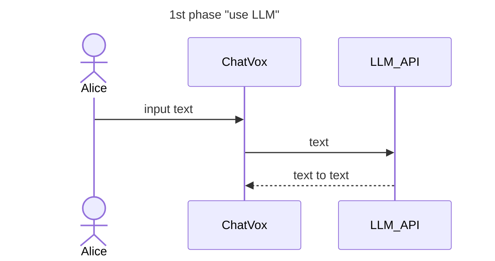
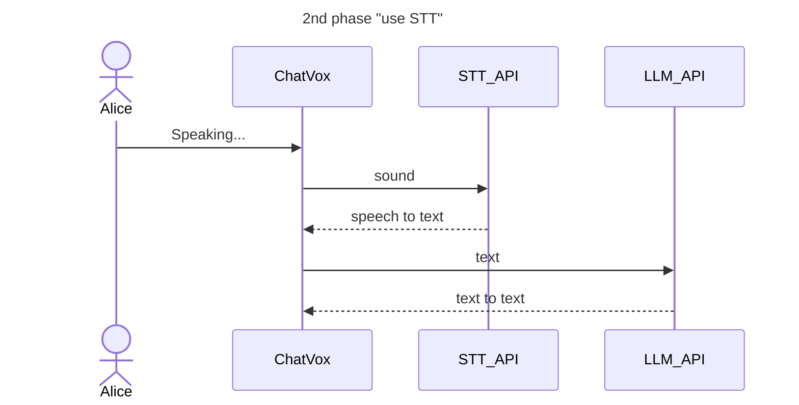
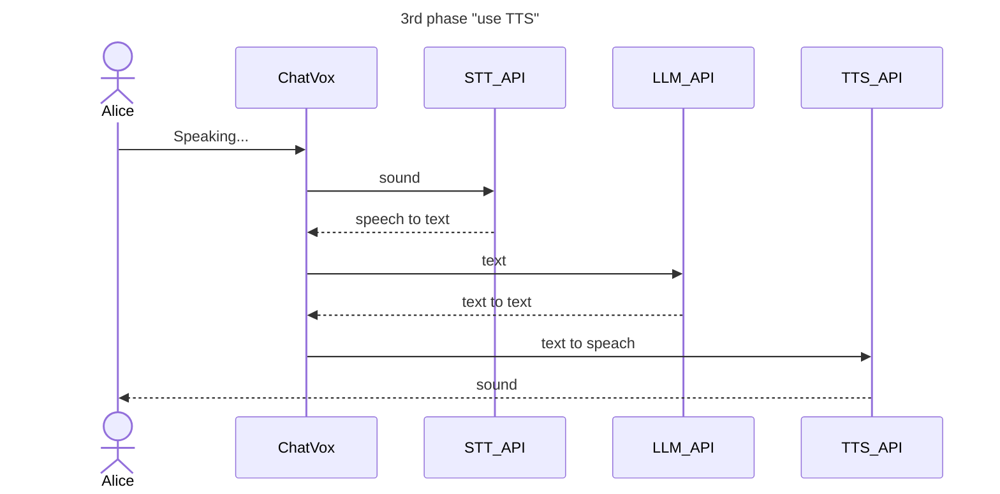

# milestone

- use LLM(ChatGPT - Azure AI Service - SemanticKernel)
- use STT(Speech to Text - Azure AI Service)
- use TTS(VOICEVOX/VOICEPEAK)
- use Image(Live2D - Cubism SDK for WEB/Unity)
- use Lipsync
- use Motion(Breathing, Blink)
- use Emote
- use LLMs
- use SKILLs

