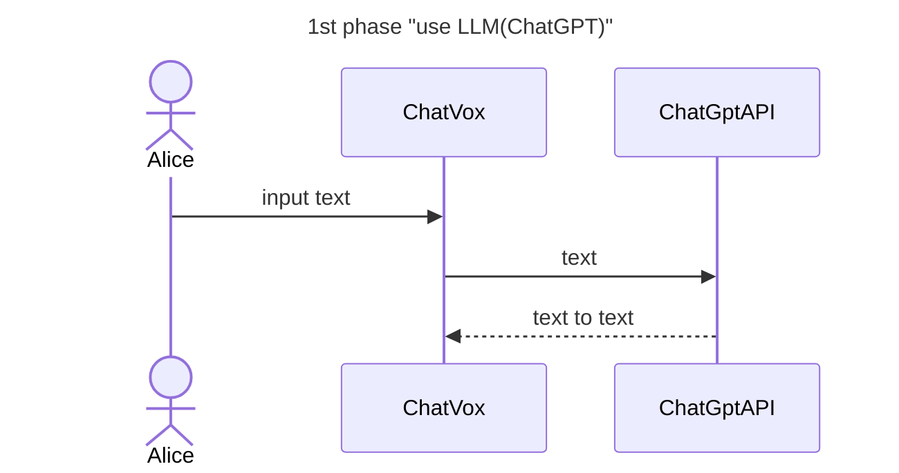
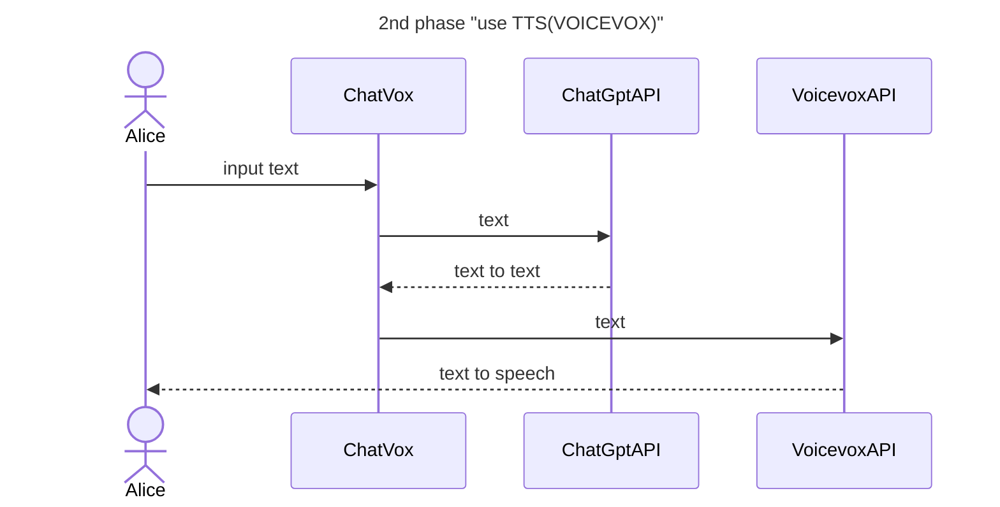
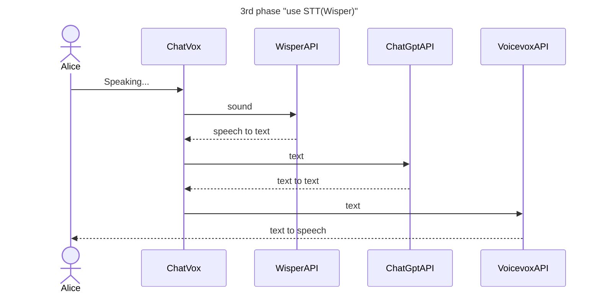

# milestone

- use LLM(ChatGPT)
- use TTS(VOICEVOX)
- use STT(Wisper)
- use Image(Live2D)
- use Lipsync
- use Motion(Breathing, Blink)
- use Emote
- use Semantic Kernel
- use LLMs
- use SKILLs

```mermaid
sequenceDiagram
    title: 1st phase "use LLM(ChatGPT)"

    actor Alice
    participant ChatVox
    participant ChatGptAPI

    Alice->>ChatVox: input text
    ChatVox->>ChatGptAPI: text
    ChatGptAPI-->>ChatVox: text to text
```

```mermaid
sequenceDiagram
    title: 2nd phase "use TTS(VOICEVOX)"

    actor Alice
    participant ChatVox
    participant ChatGptAPI
    participant VoicevoxAPI

    Alice->>ChatVox: input text
    ChatVox->>ChatGptAPI: text
    ChatGptAPI-->>ChatVox: text to text
    ChatVox->>VoicevoxAPI: text
    VoicevoxAPI-->>Alice: text to speech
```

```mermaid
sequenceDiagram
    title: 3rd phase "use STT(Wisper)"

    actor Alice
    participant ChatVox
    participant WisperAPI
    participant ChatGptAPI
    participant VoicevoxAPI

    Alice->>ChatVox: Speaking...
    ChatVox->>WisperAPI: sound
    WisperAPI-->>ChatVox: speech to text
    ChatVox->>ChatGptAPI: text
    ChatGptAPI-->>ChatVox: text to text
    ChatVox->>VoicevoxAPI: text
    VoicevoxAPI-->>Alice: text to speech
```

